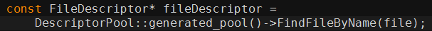
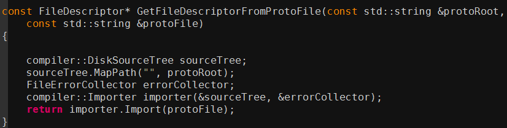
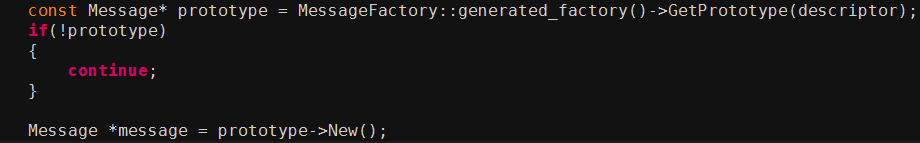
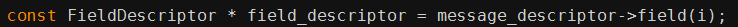
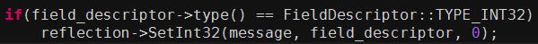

### protobuf反射总结

- 每个Message都有Descriptor和Reflection

- Descriptor的作用是获取Message的所有Field的类型

```c++
  const FieldDescriptor* field(int index) const;

  // Looks up a field by declared tag number.  Returns NULL if no such field
  // exists.
  const FieldDescriptor* FindFieldByNumber(int number) const;
  // Looks up a field by name.  Returns NULL if no such field exists.
  const FieldDescriptor* FindFieldByName(const string& name) const;

// Class FieldDescriptor
  Type type() const;                  // Declared type of this field.
  const char* type_name() const;      // Name of the declared type.
```

- Reflection是用来获取数值和写入数值的操作

```c++
  virtual double GetDouble(const Message& message,
                           const FieldDescriptor* field) const = 0;
  virtual bool   GetBool  (const Message& message,
                           const FieldDescriptor* field) const = 0;
  virtual string GetString(const Message& message,
                           const FieldDescriptor* field) const = 0;
  virtual const EnumValueDescriptor* GetEnum(
      const Message& message, const FieldDescriptor* field) const = 0;
  // See MutableMessage() for the meaning of the "factory" parameter.
  virtual const Message& GetMessage(const Message& message,
                                    const FieldDescriptor* field,
                                    MessageFactory* factory = NULL) const = 0;
  virtual Message* MutableMessage(Message* message,
                                  const FieldDescriptor* field,
                                  MessageFactory* factory = NULL) const = 0;
```

- 提问：如何处理嵌套结构
  - 先使用Descriptor获取到FieldDescriptor
  - 用Reflection，加载FieldDescriptor，再调用GetMessage或MutableMessage，就获得了下一层的Message

#### Arena　

初识 Arena 时，发现是个 allocator。Arena 每次分配一大块[内存](https://so.csdn.net/so/search?q=内存&spm=1001.2101.3001.7020)，使用时在已经分配的内存块上获取，用来代替 new/delete 的堆上分配。通过一次申请大块内存，并且一次性释放，同时可取消调用对象的析构函数来提升效率。

　　Arena 线程安全：多个线程可并发在Arena分配空间。但销毁时非线程安全，销毁线程必须和Arena 的使用者同步。

## protobuf反射机制

java在运行状态时，能够知道任意类的所有属性和方法，都能够调用任意对象的任意方法和属性。这种动态获取的信息以及动态调用对象的方法的功能称为java语言的反射机制。

C++本身没有反射机制。protobuf通过proto文件生成相应的message和service，protobuf也通过proto文件提供反射机制，程序在运行时可以通过proto获取任意message和任意service的属性和方法，也可以在运行时调用message的属性和方法。

# 获取message和service的属性和方法

protobuf通过Descriptor获取任意message或service的属性和方法，Descriptor主要包括了以下集中类型：

 

FileDescriptor 　　获取proto文件中的Descriptor和ServiceDescriptor

Descriptor 　　　  获取类message属性和方法，包括FieldDescriptor 和 EnumDescriptor等

FieldDescriptor  获取message中各个字段的类型、标签、名称等

EnumDescriptor  获取Enum中的各个字段名称、值等

ServiceDescriptor 获取service中的MethodDescriptor

MethodDescriptor 获取各个rpc中的request、response、名称等

 

当我们获得proto文件的FileDescriptor时，我们就可以获得所有的service的Descriptor和service的ServiceDescriptor，进而获取其相应的字段或rpc。也就是说，如果能获取到proto文件的FileDescriptor，就能所有的proto文件中的所有内容。

那么如何获取proto文件的FileDescriptor呢？protobuf对应以下两种不同的情况提供了相应的办法

1、 使用protoc将proto文件并生成相应的.h和.cpp文件。

这中情况下protobuf已经解析好proto文件，并将所有的Descriptor放在DescriptorPool中了。，可以根据proto的文件名，通过DescriptorPool获取到相应的FileDescriptor，例如，现有test.proto文件，那么可以通过DescriptorPool::generated_pool()获取到其FileDescriptor。其实，对于任意的message和service，也都可以根据其名称，通过DescriptorPool获取相应的Descriptor和ServiceDescriptor。例如：



2、 只有proto文件，不使用protoc。

这种情况需要去手动解析proto文件，然后再获取FileDescriptor。还好protobuf提供了相应的解析器compiler，通过compiler可以很方便得获取proto文件的FileDescriptor，具体如下：

 

# 调用message的属性和方法

想要调用message的属性和方法，就得先获取相应的message对象。protobuf的message对象都是放在MessageFactory中的，可以通过Descriptor，具体如下：

 

有了message对象，并不能直接调用其对象和方法，因为所有的message对象都是Message*类型的，但不同的message对象的属性和方法是不一样的，在这里，Message*只是指向相应的message大小的地址空间，并不知道对应的message中到底有哪些属性和方法。

protobuf是通过Reflection调用message的属性和方法的。message中的方法只有对各个属性的get和set，而调用message的属性其实也就是调用属性的get。调用message的某一个属性的get，就需要该属性的Descriptor，通过Reflection获取message获取相应的值；调用message某一属性的set，也需要该属性的Descriptor，通过Reflection将相应的值写入到message相应的属性。例如：

 



# 反射机制的应用

有了反射机制，可以写很多工具，比如：基于pb的自动化测试工具、pb转json或xml的工具、pb直接写到数据库的工具等。反射只是一种机制，有什么样的应用场景需要你的想象力！


### C++ Protobuf反射

最初是起源于这样一个问题：
 给定一个pb对象，如何自动遍历该对象的所有字段？

即是否有一个通用的方法可以遍历任意pb对象的所有字段，而不用关心具体对象类型。
 使用场景上有很多：
 比如json格式字符串的相互转换，或者bigtable里根据pb对象的字段自动写列名和对应的value。

例如定义了pb messge类型Person如下：


```css
Person person;
person.set_name("yingshin");
person.set_age(21);
```

能否将该对象自动转化为json字符串{"name":"yingshin","age":21}?

# 答案就是pb的反射功能

我们的目标是提供这样两个接口：


```cpp
//从给定的message对象序列化为固定格式的字符串
void serialize_message(const google::protobuf::Message& message, std::string* serialized_string);
//从给定的字符串按照固定格式还原为原message对象
void parse_message(const std::string& serialized_string, google::protobuf::Message* message);
```

各个类以及接口说明:

1.1 Message
 Person是自定义的pb类型，继承自Message. MessageLite作为Message基类，更加轻量级一些。
 通过Message的两个接口GetDescriptor/GetReflection，可以获取该类型对应的Descriptor/Reflection。

1.2 Descriptor
 Descriptor是对message类型定义的描述，包括message的名字、所有字段的描述、原始的proto文件内容等。
 本文中我们主要关注跟字段描述相关的接口，例如：


```csharp
获取所有字段的个数：int field_count() const
获取单个字段描述类型FieldDescriptor的接口有很多个，例如
  
const FieldDescriptor* field(int index) const;//根据定义顺序索引获取
const FieldDescriptor* FindFieldByNumber(int number) const;//根据tag值获取
const FieldDescriptor* FindFieldByName(const string& name) const;//根据field name获取
```

1.3 FieldDescriptor
 FieldDescriptor描述message中的单个字段，例如字段名，字段属性(optional/required/repeated)等。
 对于proto定义里的每种类型，都有一种对应的C++类型，例如：


```rust
enum CppType {
    CPPTYPE_INT32 = 1, //TYPE_INT32, TYPE_SINT32, TYPE_SFIXED32
}
获取类型的label属性：

  
enum Label {
    LABEL_OPTIONAL = 1, //optional
    LABEL_REQUIRED = 2, //required
    LABEL_REPEATED = 3, //repeated
    MAX_LABEL = 3, //Constant useful for defining lookup tables indexed by Label.
}
获取字段的名称:const string& name() const;。
```

1.4 Reflection
 Reflection主要提供了动态读写pb字段的接口，对pb对象的自动读写主要通过该类完成。
 对每种类型，Reflection都提供了一个单独的接口用于读写字段对应的值。

例如对于读操作：


```cpp
  virtual int32  GetInt32 (const Message& message,
                           const FieldDescriptor* field) const = 0;
  virtual int64  GetInt64 (const Message& message,
                           const FieldDescriptor* field) const = 0;
特殊的，对于枚举和嵌套的message：

  
  virtual const EnumValueDescriptor* GetEnum(
      const Message& message, const FieldDescriptor* field) const = 0;
  // See MutableMessage() for the meaning of the "factory" parameter.
  virtual const Message& GetMessage(const Message& message,
                                    const FieldDescriptor* field,
                                    MessageFactory* factory = NULL) const = 0;
对于写操作也是类似的接口，例如SetInt32/SetInt64/SetEnum等。
```

1. 反射示例
    示例主要是接收任意类型的message对象，遍历解析其中的每个字段、以及对应的值，按照自定义的格式存储到一个string中。同时重新反序列化该string，读取字段以及value，填充到message对象中。例如：

其中Person是自定义的protobuf message类型，用于设置一些字段验证我们的程序。
 单纯的序列化/反序列化功能可以通过pb自带的SerializeToString/ParseFromString接口完成。这里主要是为了同时展示自动从pb对象里提取field/value，自动根据field/value来还原pb对象这个功能。


```php
int main() {
  std::string serialized_string;
  {
      tutorial::Person person;
      person.set_name("yingshin");
      person.set_id(123456789);
      person.set_email("zhy198606@gmail.com");
      ::tutorial::Person_PhoneNumber* phone = person.mutable_phone();
      phone->set_type(tutorial::Person::WORK);
      phone->set_number("13266666666");
      serialize_message(person, &serialized_string);
  }
  {
      tutorial::Person person;
      parse_message(serialized_string, &person);
  }
  return 0;
}
```

其中Person定义是对example里的addressbook.proto做了少许修改(修改的原因是本文没有涉及pb里数组的处理)


```swift
package tutorial;
message Person {
required string name = 1;
required int32 id = 2;        // Unique ID number for this person.
optional string email = 3;
enum PhoneType {
    MOBILE = 0;
    HOME = 1;
    WORK = 2;
}
message PhoneNumber {
    required string number = 1;
    optional PhoneType type = 2 [default = HOME];
}
optional PhoneNumber phone = 4;
}
```

1. 反射实例实现
    3.1 serialize_message
    serialize_message遍历提取message中各个字段以及对应的值，序列化到string中。
    主要思路就是通过Descriptor得到每个字段的描述符：字段名、字段的cpp类型。
    通过Reflection的GetX接口获取对应的value。


```cpp
void serialize_message(const google::protobuf::Message& message, std::string* serialized_string) {
  const google::protobuf::Descriptor* descriptor = message.GetDescriptor();
  const google::protobuf::Reflection* reflection = message.GetReflection();
  for (int i = 0; i < descriptor->field_count(); ++i) {
      const google::protobuf::FieldDescriptor* field = descriptor->field(i);
      bool has_field = reflection->HasField(message, field);
      if (has_field) {
          //arrays not supported
          assert(!field->is_repeated());
          switch (field->cpp_type()) {
#define CASE_FIELD_TYPE(cpptype, method, valuetype)\
              case google::protobuf::FieldDescriptor::CPPTYPE_##cpptype:{\
                  valuetype value = reflection->Get##method(message, field);\
                  int wsize = field->name().size();\
                  serialized_string->append(reinterpret_cast<char*>(&wsize), sizeof(wsize));\
                  serialized_string->append(field->name().c_str(), field->name().size());\
                  wsize = sizeof(value);\
                  serialized_string->append(reinterpret_cast<char*>(&wsize), sizeof(wsize));\
                  serialized_string->append(reinterpret_cast<char*>(&value), sizeof(value));\
                  break;\
              }
              CASE_FIELD_TYPE(INT32, Int32, int);
              CASE_FIELD_TYPE(UINT32, UInt32, uint32_t);
              CASE_FIELD_TYPE(FLOAT, Float, float);
              CASE_FIELD_TYPE(DOUBLE, Double, double);
              CASE_FIELD_TYPE(BOOL, Bool, bool);
              CASE_FIELD_TYPE(INT64, Int64, int64_t);
              CASE_FIELD_TYPE(UINT64, UInt64, uint64_t);
#undef CASE_FIELD_TYPE
              case google::protobuf::FieldDescriptor::CPPTYPE_ENUM: {
                  int value = reflection->GetEnum(message, field)->number();
                  int wsize = field->name().size();
                  //写入name占用字节数
                  serialized_string->append(reinterpret_cast<char*>(&wsize), sizeof(wsize));
                  //写入name
                  serialized_string->append(field->name().c_str(), field->name().size());
                  wsize = sizeof(value);
                  //写入value占用字节数
                  serialized_string->append(reinterpret_cast<char*>(&wsize), sizeof(wsize));
                  //写入value
                  serialized_string->append(reinterpret_cast<char*>(&value), sizeof(value));
                  break;
              }
              case google::protobuf::FieldDescriptor::CPPTYPE_STRING: {
                  std::string value = reflection->GetString(message, field);
                  int wsize = field->name().size();
                  serialized_string->append(reinterpret_cast<char*>(&wsize), sizeof(wsize));
                  serialized_string->append(field->name().c_str(), field->name().size());
                  wsize = value.size();
                  serialized_string->append(reinterpret_cast<char*>(&wsize), sizeof(wsize));
                  serialized_string->append(value.c_str(), value.size());
                  break;
              }
              case google::protobuf::FieldDescriptor::CPPTYPE_MESSAGE: {
                  std::string value;
                  int wsize = field->name().size();
                  serialized_string->append(reinterpret_cast<char*>(&wsize), sizeof(wsize));
                  serialized_string->append(field->name().c_str(), field->name().size());
                  const google::protobuf::Message& submessage = reflection->GetMessage(message, field);
                  serialize_message(submessage, &value);
                  wsize = value.size();
                  serialized_string->append(reinterpret_cast<char*>(&wsize), sizeof(wsize));
                  serialized_string->append(value.c_str(), value.size());
                  break;
              }
          }
      }
  }
}
```

3.2 parse_message
 parse_message通过读取field/value，还原message对象。
 主要思路跟serialize_message很像，通过Descriptor得到每个字段的描述符FieldDescriptor，通过Reflection的SetX填充message。


```cpp
void parse_message(const std::string& serialized_string, google::protobuf::Message* message) {
  const google::protobuf::Descriptor* descriptor = message->GetDescriptor();
  const google::protobuf::Reflection* reflection = message->GetReflection();
  std::map<std::string, const google::protobuf::FieldDescriptor*> field_map;
  for (int i = 0; i < descriptor->field_count(); ++i) {
      const google::protobuf::FieldDescriptor* field = descriptor->field(i);
      field_map[field->name()] = field;
  }
  const google::protobuf::FieldDescriptor* field = NULL;
  size_t pos = 0;
  while (pos < serialized_string.size()) {
      int name_size = *(reinterpret_cast<const int*>(serialized_string.substr(pos, sizeof(int)).c_str()));
      pos += sizeof(int);
      std::string name = serialized_string.substr(pos, name_size);
      pos += name_size;
      int value_size = *(reinterpret_cast<const int*>(serialized_string.substr(pos, sizeof(int)).c_str()));
      pos += sizeof(int);
      std::string value = serialized_string.substr(pos, value_size);
      pos += value_size;
      std::map<std::string, const google::protobuf::FieldDescriptor*>::iterator iter =
          field_map.find(name);
      if (iter == field_map.end()) {
          fprintf(stderr, "no field found.\n");
          continue;
      } else {
          field = iter->second;
      }
      assert(!field->is_repeated());
      switch (field->cpp_type()) {
#define CASE_FIELD_TYPE(cpptype, method, valuetype)\
          case google::protobuf::FieldDescriptor::CPPTYPE_##cpptype: {\
              reflection->Set##method(\
                      message,\
                      field,\
                      *(reinterpret_cast<const valuetype*>(value.c_str())));\
              std::cout << field->name() << "\t" << *(reinterpret_cast<const valuetype*>(value.c_str())) << std::endl;\
              break;\
          }
          CASE_FIELD_TYPE(INT32, Int32, int);
          CASE_FIELD_TYPE(UINT32, UInt32, uint32_t);
          CASE_FIELD_TYPE(FLOAT, Float, float);
          CASE_FIELD_TYPE(DOUBLE, Double, double);
          CASE_FIELD_TYPE(BOOL, Bool, bool);
          CASE_FIELD_TYPE(INT64, Int64, int64_t);
          CASE_FIELD_TYPE(UINT64, UInt64, uint64_t);
#undef CASE_FIELD_TYPE
          case google::protobuf::FieldDescriptor::CPPTYPE_ENUM: {
              const google::protobuf::EnumValueDescriptor* enum_value_descriptor =
                  field->enum_type()->FindValueByNumber(*(reinterpret_cast<const int*>(value.c_str())));
              reflection->SetEnum(message, field, enum_value_descriptor);
              std::cout << field->name() << "\t" << *(reinterpret_cast<const int*>(value.c_str())) << std::endl;
              break;
          }
          case google::protobuf::FieldDescriptor::CPPTYPE_STRING: {
              reflection->SetString(message, field, value);
              std::cout << field->name() << "\t" << value << std::endl;
              break;
          }
          case google::protobuf::FieldDescriptor::CPPTYPE_MESSAGE: {
              google::protobuf::Message* submessage = reflection->MutableMessage(message, field);
              parse_message(value, submessage);
              break;
          }
          default: {
              break;
          }
      }
  }
}
```

------------------------------以下为新增内容：
 为了支持std::cout 直接调用pb序列化后的内容，且支持repeated 类型，新的接口如下：


```php
void serialize_message_to_str(const google::protobuf::Message &message, std::string *serialized_str) {
    const google::protobuf::Descriptor* descriptor = message.GetDescriptor();
    const google::protobuf::Reflection* reflection = message.GetReflection();
    for (int i = 0; i < descriptor->field_count(); ++i) {
        const google::protobuf::FieldDescriptor* field = descriptor->field(i);
        if (field->is_repeated()) {
            //repeated
            int fieldSize = reflection->FieldSize(message, field);
            switch (field->cpp_type()) {
#define CASE_REPEATED_FIELD_TYPE(cpptype, method, valuetype)\
                case google::protobuf::FieldDescriptor::CPPTYPE_##cpptype:{\
                    serialized_str->append("repedted_field:\t");\
                    serialized_str->append(field->name().c_str(), field->name().size());\
                    serialized_str->append("\t");\
                    for(int i = 0; i < fieldSize; ++i) {\
                        valuetype value = reflection->GetRepeated##method(message, field, i);\
                        serialized_str->append(std::to_string(value));\
                        serialized_str->append("\t");\
                    }\
                    break;\
                }
                CASE_REPEATED_FIELD_TYPE(INT32, Int32, int);
                CASE_REPEATED_FIELD_TYPE(UINT32, UInt32, uint32_t);
                CASE_REPEATED_FIELD_TYPE(FLOAT, Float, float);
                CASE_REPEATED_FIELD_TYPE(DOUBLE, Double, double);
                CASE_REPEATED_FIELD_TYPE(BOOL, Bool, bool);
                CASE_REPEATED_FIELD_TYPE(INT64, Int64, int64_t);
                CASE_REPEATED_FIELD_TYPE(UINT64, UInt64, uint64_t);
#undef CASE_REPEATED_FIELD_TYPE
                case google::protobuf::FieldDescriptor::CPPTYPE_STRING: {
                    serialized_str->append("repedted_field:\t");
                    serialized_str->append(field->name().c_str(), field->name().size());
                    serialized_str->append("\t");
                    for(int i = 0; i < fieldSize; ++i) {
                        std::string value = reflection->GetRepeatedString(message, field, i);
                        serialized_str->append(value.c_str(), value.size());
                        serialized_str->append("\t");
                    }
                    break;
                }
                case google::protobuf::FieldDescriptor::CPPTYPE_ENUM: {
                    serialized_str->append("repedted_field:\t");
                    serialized_str->append(field->name().c_str(), field->name().size());
                    serialized_str->append("\t");
                    for(int i = 0; i < fieldSize; ++i) {
                        int value = reflection->GetRepeatedEnumValue(message, field, i);
                        serialized_str->append(std::to_string(value));
                        serialized_str->append("\t");
                    }
                    break;
                }
                case google::protobuf::FieldDescriptor::CPPTYPE_MESSAGE: {
                    serialized_str->append("repedted_field[sub_message]:\t");
                    serialized_str->append(field->name().c_str(), field->name().size());
                    serialized_str->append("\t");
                    std::string value;
                    for(int i = 0 ;i < fieldSize; ++i) {
                        const google::protobuf::Message& submessage = reflection->GetRepeatedMessage(message, field, i);
                        serialize_message_to_str(submessage, &value);
                    }
                    serialized_str->append(value.c_str(), value.size());
                    serialized_str->append("\t]");
                    break;
                }
            }
            
            continue;
        } 

        bool has_field = reflection->HasField(message, field);
        if (has_field) {
            //arrays not supported
            //assert(!field->is_repeated());
            switch (field->cpp_type()) {
#define CASE_FIELD_TYPE(cpptype, method, valuetype)\
                case google::protobuf::FieldDescriptor::CPPTYPE_##cpptype:{\
                    valuetype value = reflection->Get##method(message, field);\
                    serialized_str->append(field->name().c_str(), field->name().size());\
                    serialized_str->append("\t");\
                    serialized_str->append(std::to_string(value));\
                    serialized_str->append("\t");\
                    break;\
                }
                CASE_FIELD_TYPE(INT32, Int32, int);
                CASE_FIELD_TYPE(UINT32, UInt32, uint32_t);
                CASE_FIELD_TYPE(FLOAT, Float, float);
                CASE_FIELD_TYPE(DOUBLE, Double, double);
                CASE_FIELD_TYPE(BOOL, Bool, bool);
                CASE_FIELD_TYPE(INT64, Int64, int64_t);
                CASE_FIELD_TYPE(UINT64, UInt64, uint64_t);
#undef CASE_FIELD_TYPE
                case google::protobuf::FieldDescriptor::CPPTYPE_ENUM: {
                    int value = reflection->GetEnum(message, field)->number();
                    int wsize = field->name().size();
                    //写入name
                    serialized_str->append(field->name().c_str(), field->name().size());
                    serialized_str->append("\t");
                    //写入value
                    serialized_str->append(std::to_string(value));
                    serialized_str->append("\t");
                    break;
                }
                case google::protobuf::FieldDescriptor::CPPTYPE_STRING: {
                    std::string value = reflection->GetString(message, field);
                    serialized_str->append(field->name().c_str(), field->name().size());
                    serialized_str->append("\t");
                    serialized_str->append(value.c_str(), value.size());
                    serialized_str->append("\t");
                    break;
                }
                case google::protobuf::FieldDescriptor::CPPTYPE_MESSAGE: {
                    std::string value;
                    serialized_str->append("sub_message:\t");
                    serialized_str->append(field->name().c_str(), field->name().size());
                    serialized_str->append("\t[");
                    const google::protobuf::Message& submessage = reflection->GetMessage(message, field);
                    serialize_message_to_str(submessage, &value);
                    serialized_str->append(value.c_str(), value.size());
                    serialized_str->append("\t]");
                    break;
                }
            }
        }
    }
}
```

-------

我们先看一下JAVA反射的概念： 
主要是指程序可以访问，检测和修改它本身状态或行为的一种能力，并能根据自身行为的状态和结果，调整或修改应用所描述行为的状态和相关的语义。 
反射是Java中一种强大的工具，能够使我们很方便的创建灵活的代码，这些代码可以再运行时装配，无需在组件之间进行源代码链接。但是反射使用不当会成本很高！ 

说的很学术，看的也有点晕。 说白了就是，在运行时根据类的名字(字符串)，创建类实例的能力。 
当然还包含类的一些内部成员的信息，这样创建出来的实例就可以动态的调用类的方法以及成员。 

JAVA在语言层面，提供了对Reflection的支持，当然还包括一些解释型语言也提供了反射支持，因为动态解释行语言支持起来是相对容易的。 

C++ 在语言本身并没有支持反射机制,但是protobuf通过维护一些内部数据结构，提供了对proto文件生成的file, message, filed数据结构提供了反射的支持。 
这对于远程调用，的类型识别作用非常大。试想一下，你只需要把message类型的字符串，和序列化的二禁止数据，传输给远端，远端服务器就可以根据message类型 
构建类型对象，进而反序列化，还原本端的对象实例。应用程序，在也不用维护类型ID到对象实例的对应关系，这是非常方便的。 

那么protobuf是怎么实现这种反射机制呢。下面我会从源码的角度分析一下。这里我们会从结果倒推回去的逆向逻辑。 

1， 所有的生成的集成于message类型的子类，都实现了prototype 模式（支持从一个对象的实例，构造出另一个队像）。 
2,  message的子类都有它本身的静态对象， 这样如果找到这个类静态对象，则可以使用这个对象new 一个新的对象实例。 
class Person : public ::google::protobuf::Message /* @@protoc_insertion_point(class_definition:tutorial.Person) */ { 
 public: 
  Person(); 
  virtual ~Person(); 

  Person(const Person& from); 

  inline Person& operator=(const Person& from) { 
    CopyFrom(from); 
    return *this; 
  } 
  static const ::google::protobuf::Descriptor* descriptor(); 
  static const Person& default_instance();              //一个今天的Person对象， 他的作用就是调用NEW生成新的对象。 

  void Swap(Person* other); 

  inline Person* New() const { return New(NULL); }      //New 会生成一个新的对象的指针。 
  Person* New(::google::protobuf::Arena* arena) const; 
  const ::google::protobuf::Descriptor* Person_descriptor_ = NULL;  //Person 的 Descriptor 

3，message类的Descriptor会跟 default_instance，建立一个映射，这样就能通过Descriptor找到default_instance 
   这个映射关系的建立，引入了另外一个中间的类。 
   void protobuf_RegisterTypes(const ::std::string&) { 
      protobuf_AssignDescriptorsOnce(); 
      ::google::protobuf::MessageFactory::InternalRegisterGeneratedMessage( 
      Person_descriptor_, &Person::default_instance());  //这里MessageFactory会注册Descriptor到default_instance的映射关系。 

4， 那接下来要做什么呢，当然是怎样找到一个message的Descriptor. 
   class LIBPROTOBUF_EXPORT DescriptorPool { 
   public: 
   // Create a normal, empty DescriptorPool. 
   DescriptorPool(); 
      const Descriptor* FindMessageTypeByName(const string& name) const;   //DescriptorPool是一个全局对象， 他提供了根据字符串找到 Descriptor的机制。 
   const FieldDescriptor* FindFieldByName(const string& name) const; 
   const FieldDescriptor* FindExtensionByName(const string& name) const; 
   const OneofDescriptor* FindOneofByName(const string& name) const; 
   const EnumDescriptor* FindEnumTypeByName(const string& name) const; 
   const EnumValueDescriptor* FindEnumValueByName(const string& name) const; 
   const ServiceDescriptor* FindServiceByName(const string& name) const; 
   const MethodDescriptor* FindMethodByName(const string& name) const; 


//第一种方式：   
Classc1 = Class.forName("Employee");   
//第二种方式：   
//java中每个类型都有class 属性.   
Classc2 = Employee.class;   
    
//第三种方式：   
//java语言中任何一个java对象都有getClass 方法   
Employee  e = new Employee();   
Classc3 = e.getClass(); //c3是运行时类 (e的运行时类是Employee) 

