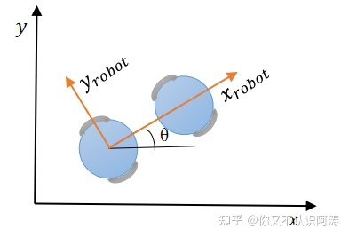
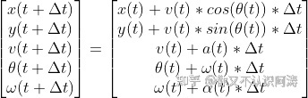
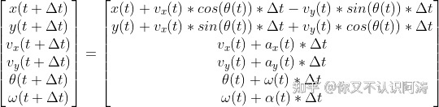
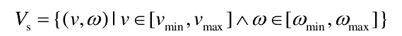
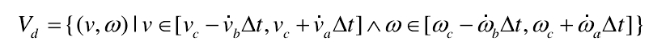
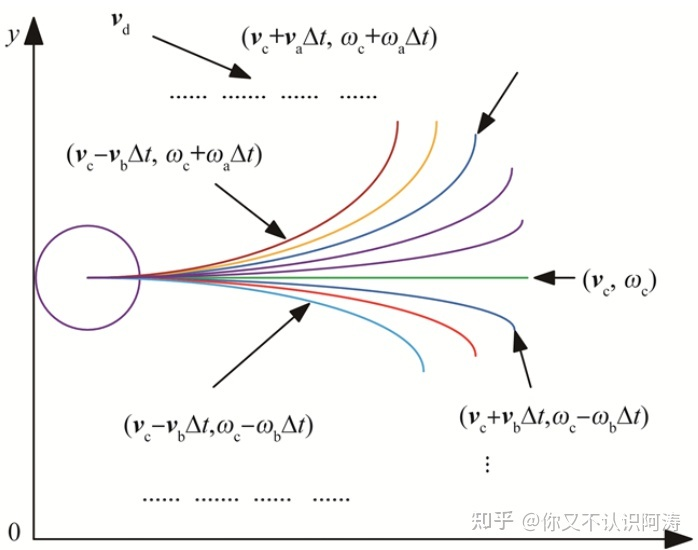

### Dynamic window approach

## 1 DWA算法概述

DWA算法（dynamic window approach），其原理主要是在速度空间（v,w）中**采样多组速度**，并模拟出这些速度在一定时间内的**运动轨迹**，并通过**评价函数**对这些轨迹进行评价，**选取最优轨迹**对应的（v,w）驱动机器人运动。

注：速度空间（v,w）：速度搜索空间，受到各种限制条件，后面会详细谈到。评价函数可以根据自己的需求进行更改，原始论文和ROS中的评价函数不一样。

**优点：**

- **计算复杂度低**：考虑到速度和加速度的限制，只有安全的轨迹会被考虑，且每次采样的时间较短，因此轨迹空间较小
- **可以实现避障**：可以实时避障，但是避障效果一般
- **适用于两轮差分和全向移动模型**

**缺点：**

- **前瞻性不足**：只模拟并评价了下一步，如在机器人前段遇见“C”字形障碍时，不能很好的避障
- **动态避障效果差：** 模拟运动轨迹断，动态避障效果差
- **非全局最优路径：** 每次都选择下一步的最佳路径，而非全局最优路径
- **不适用于阿克曼模型**

## **2 机器人运动学模型**

**为什么要分析机器人运动学模型？应为要根据采样的速度（v,w）模拟机器人运动的轨迹，因此先要分析机器人运动学模型。下面以两轮移动机器人模型，分两个方面进行分析。**

### **2.1 非全向移动机器人（v,w）**

机器人只能向前运动或者旋转**；**需要注意的是，上图中有两个坐标系，一个是机器人的坐标系，另外一个是世界坐标系（也就是我们的坐标轴），下式中v(t)指的是机器人坐标系中x方向的速度；t+ △t时刻与 t时刻的位置、速度关系式如下：

### **2.2 全向移动机器人（** Vx，Vy）

对于全向移动机器人，在机器人坐标系中，不仅有x方向的速度，还有y方向的速度，另外还可以旋转。t+△t时刻与 t时刻的位置、速度关系式如下：

需要补充说明的是，**令** **Vy(t)=0，上式与2.1中公式表达式完全相同**，故ROS中采用2.2中的公式进行计算，所以DWA算法适用于两轮差速和全向移动机器人。

## **3 速度空间(v,w)**

**现在我们能够解决机器人运动轨迹的问题，但是速度空间（v,w）的问题还没有解决，我们能够进行采样的速度搜索空间是多少呢？机器人的速度受到各种因素限制，下面做一个简单的探讨。**

### **3.1** 移动机器人受自身最大速度最小速度的限制

Vs 为机器人能够到达的所有矢量速度的集合；机器人受到最大最小线速度和角速度影响。

### 3.2 移动机器人受电机性能的影响

由于加速度有一个范围限制，所以最大加速度或最大减速度一定时间内能达到的速度 ，才会被保留，表达式如下：

### 3.3 移动机器人受障碍的影响

为了能在碰到障碍物前停下来，在最大减速度的条件下，速度满足以下条件：

其中dist(v,w)为（v,w）对应的轨迹上里障碍物最近的距离。

在上述三条约束条件的限制下，速度空间（v,w）会有一定的范围，另外会随着电机的线加速度、角加速度进行变换，速度空间会动态变化，我们将其称为**动态窗口**。在满足约束条件的情况下，进行采样（v,w），可以得到相应的轨迹：

## **4 评价函数**

**在速度空间（v,w）中采样，根据运动学模型推测对应的轨迹，接下来引入评价函数，对轨迹进行打分，选取最优的轨迹。**

一般来说，评价函数如下：

其中，heading(v,w)为方位角评价函数：评价机器人在当前的设定的速度下，轨迹末端朝向与目标点之间的角度差距；dist(v,w) 主要的意义为机器人处于预测轨迹末端点位置时与地图上最近障碍物的距离，对于靠近障碍物的采样点进行惩罚，确保机器人的避障能力，降低机器人与障碍物发生碰撞的概率；velocity(v,w)为当前机器人的线速度，为了促进机器人快速到达目标；α、β、γ、σ为权重。当然，可以对评价函数进行优化，添加更多的评价函数指标。

## **5 总结**

以上就是我对DWA算法的一点浅显理解和总结，在这个过程中参考了不少别人的文章，放在文末。首先，搞清楚机器人运动学模型，在分析其他算法的时候也会用到，上述分析基于两轮差速移动机器人，从而推算（v,w）对应的轨迹。其次，在什么范围内进行速度抽样，会受到三种因素的限制，从而确定速度采样空间或者说是动态窗口。最后，通过评价函数对轨迹进行筛选，评价函数可以自己根据侧重的性能进行选择。

## **参考文献**

《The Dynamic Window Approach To Collision Avoidance》

[机器人局部避障的动态窗口法(dynamic window approach)](https://link.zhihu.com/?target=https%3A//heyijia.blog.csdn.net/article/details/44983551%3Fspm%3D1001.2014.3001.5506)

[DWA算法分析_MARK&的博客-CSDN博客_dwa算法](https://link.zhihu.com/?target=https%3A//blog.csdn.net/peakzuo/article/details/86487923%3Fspm%3D1001.2014.3001.5506)

[【自动驾驶轨迹规划之DWA算法】_无意2121的博客-CSDN博客_dwa轨迹规划](https://link.zhihu.com/?target=https%3A//blog.csdn.net/weixin_65089713/article/details/123955584%3Fspm%3D1001.2014.3001.5506)

[郑小添：ROS学习笔记-局部路径规划算法对比](https://zhuanlan.zhihu.com/p/438853951)