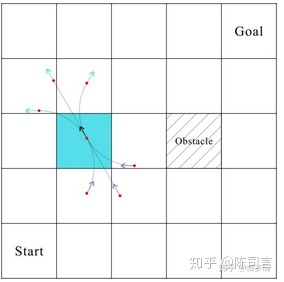
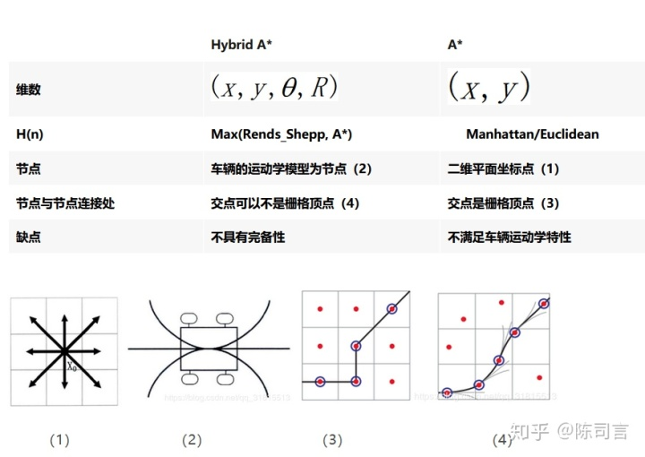
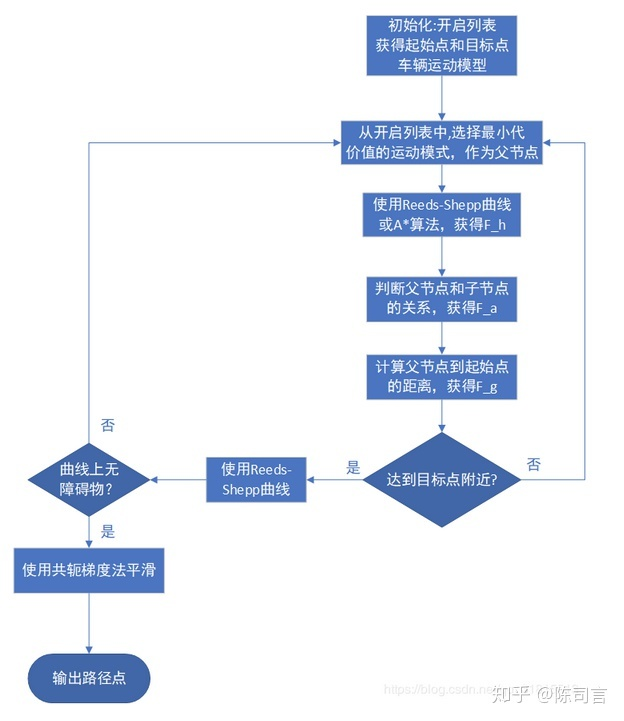

## Hybrid A*

Hybrid A*是在A*算法的基础上考虑物体实际运动约束的一种算法，最早是在2010年由斯坦福大学提出，并在DARPA的城市挑战赛得以应用。文章链接如下：

[https://github.com/wanghuohuo0716/hybrid_A_star/blob/master/doc/Practical_Search_Techniques_in_Path_Planning_for_Autonomous_Driving.pdfgithub.com/wanghuohuo0716/hybrid_A_star/blob/master/doc/Practical_Search_Techniques_in_Path_Planning_for_Autonomous_Driving.pdf](http://link.zhihu.com/?target=https%3A//github.com/wanghuohuo0716/hybrid_A_star/blob/master/doc/Practical_Search_Techniques_in_Path_Planning_for_Autonomous_Driving.pdf)

在普通的A\*中，我们不考虑运动物体的方向，而且也不需要考虑物体的运动实际，我们假定物体总能转移到邻近格点中。但在Hybrid A*中我们需要考虑物体的方向，在下图中我们用带箭头的点表示一个物体的位置，在A\*中，物体总是出现在网格中心，在Hybrid A\*中，由于考虑了物体的实际运动约束，所以物体并不一定出现在格点中心（可以出现在每个格中的任意位置，但是每个格内只出现一次）。由一个特定的位置出发，物体在下一步搜索中只能到达它可能到达的位置。例如在汽车中，受制于汽车转向角的限制，绿色箭头表示车辆前进时候可以到达的位置，灰色箭头表示倒退时可以到达的位置。[[1\]](#ref_1)

**二、与A\*的区别与联系**[[2\]](#ref_2)

**三、Hybrid A\*基本流程图**

Hybrid A*继承了A*的很多思想，比如还有Open和Close集合，还有两种花费，**实际花费F_g**和**预期花费F_h**。但是这两种花费定义的都比A*中更加复杂，在A*中我们定义**实际花费F_g**只有走过的距离，但在Hybrid A*中就要考虑很多其他因素，比如说转向角的改变，是否倒车，车辆行驶方向是否改变等等。另外**预期花费F_h**也不同于A*中的欧式距离，我们选择了由A*所得到的到达终点的花费来作为Hybrid A*的预期花费。

Reeds-Shepp 曲线是一种路径规划方法，假设车辆能够以固定的半径转向，且车辆能够前进和后退，那么Reeds-Shepp曲线就是车辆在上述条件下从起点到终点的最短路径。该曲线不仅能保证车辆能够到达终点，而且能保证车辆的角度能在终点到达预期角度。关于**Reeds-Shepp曲线**，可以参考下面这篇文章：