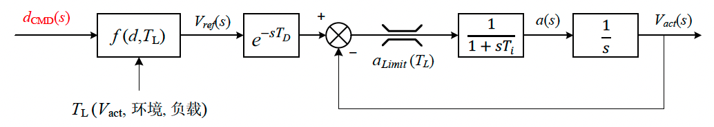

- 符号定义

$$
C_T、C_e\ -\ 电机转矩常数、电机电动势常数，与电机结构有关\\n\ -\ 转速，单位rpm\\I_a\ - 电枢电流;\ U_a - 电枢两端电压，即输入电压\\R_a - 电枢线圈电阻;\ L_a\ -\ 电枢等效电感\\J\ - 转动惯量;\ T_e\ - 电磁转矩;\ T_L\ - 负载转矩（含损耗）
$$

- 电磁转矩

$$
T_e=C_T{\Phi}I_a
$$

- 电枢反电动势

$$
E_a=C_e\Phi n
$$

- 转速稳态：

$$
n=\frac{U_a-I_aR_a}{C_e\Phi}
$$

- 转速动态：

$$
\frac{dn}{dt}=\frac{d\Omega}{dt}\cdot\frac{60}{2\pi}=\frac{T_e-T_L}{J}\cdot\frac{60}{2\pi}
$$

- 电枢电流稳态：

$$
I_a=\frac{T_L}{C_T\Phi}
$$

- 电枢电流动态：

$$
\frac{dI_a}{dt}=\frac{U_a-E_a-I_aR_a}{L_a}
$$

##### 系统建模框图

- 根据上述公式，可以总结为如下的系统框图

##### 总结

- 稳态值：

  - 电流稳态值取决于负载转矩TL
  - 转速稳态值主要取决于电枢电压，也就是占空比，其次随着负载增大，电枢压降会略微增加，导致速度下降。

- 动态情况

  - 电流到转速是明确的一阶系统

    - 时间常数相关参数：电机结构、转动惯量

  - 电压到电流可近似为一阶系统

    - 时间常数相关参数：电枢电感

    - $$
      \frac{I_a(s)}{U_a(s)}=\frac{s}{s^2L_a+sR_a+K}\\K=C_TC_e{\Phi}^2\cdot\frac{60}{2\pi\cdot J}
      $$

    - （感觉了一下K应该比较小，最好有参数验证想法），在较高频率，可近似认为

    - $$
      \frac{I_a(s)}{U_a(s)}\approx\frac{1}{sL_a+R_a}
      $$

- 对于车辆

  - 稳态速度 -- 近似正比于输入占空比
  - 加速度 -- 电枢电流
  - 还有一点需要注意：
    - 电机转速和车轮等效转速相同，车辆速度达到车轮速度有一个惯性过程，若轮胎刚度够大，该惯性环节的延时可忽略。

##### 目前的速度闭环控制

##### 明诺底盘模型深入

我最近仔细看了下数据，内部似乎是有一个电流环限幅（实现方式为硬件或软件未知），但是未得到供应商的证实。考虑到电流限幅的影响，电机模型应该是这样的：

对应车辆，等价于有一个加速度的限幅

##### 明诺底盘模型简化

以上模型看起来比较复杂，（仅对于动态过程，电流环限幅生效时）可以进一步简化结构为下图所示：

对于稳态，电流环限幅不生效时，则应该依然使用之前的模型，考虑小信号动态（为简化分析，这里忽略了负载转矩随输出变化）可简化为如图所示的小信号模型，该模型可用于闭环稳定性分析。

$$
G_{iu}(s)=\frac{\hat{i_a}(s)}{\hat{u_a}(s)}=\frac{s}{s^2L_a+sR_a+K}\\
G_{ni}(s)=\frac{\hat{n}(s)}{\hat{i_a}(s)}=C_T{\Phi}\cdot\frac{60}{2\pi\cdot sJ}\\
G_{nu}(s)=\frac{\hat{n}(s)}{\hat{u_a}(s)}=G_{iu}(s)G_{ni}(s)=\frac{K}{s^2L_a+sR_a+K}\cdot \frac{1}{C_e\Phi}\\
K=C_TC_e{\Phi}^2\cdot\frac{60}{2\pi\cdot J}
$$

##### 明诺底盘参数估算

找供应商拿不到参数，只好自己估算了，以3月测试工况作为参考

根据稳态电流，1m/s时为16A，2m/s时为19A，可估计负载力矩与车辆速度*v*有如下关系：
$$
T_L=(13+3v)\cdot C_T\Phi\tag{1}
$$
根据加速度的情况，0.5m/s附近约为0.65m/s2，1.5m/s附近约为0.55m/s2，可估计最大加速度和车速有如下关系：
$$
a_{Limit}=0.64-0.06v\tag{2}
$$
根据明诺车辆的齿轮比和轮周长
$$
a=\frac{dv}{dt}=\frac{1}{60\cdot11.1}\cdot0.9425\cdot\frac{dn}{dt}=0.00141516\frac{dn}{dt}\tag3
$$
根据电机模型有
$$
a_{Limit}(T_L)=(I_{max}-\frac{T_L}{C_T\Phi})\cdot C_T\Phi\cdot\frac{1}{J}\cdot\frac{60}{2\pi}\cdot0.00141516\tag4
$$
而电机电流内环限幅 Imax ≈ 45A，对比(1)(2)可算得下式的Ka = 0.02
$$
a_{Limit}(T_L)=(I_{max}-\frac{T_L}{C_T\Phi})\cdot K_a
$$

$$
\frac{C_T\Phi}{J}=1.48
$$

电枢电压52V，对应转速1770转，以及考虑稳态电枢电阻压降估算得：
$$
C_e\Phi\approx0.025
$$
电枢电阻，只能随便估计了，大约0.2Ω，电枢电感，根据电流波形，大概估计为
$$
L=0.08 H
$$
电流上升时间约为0.2秒，若当成1阶系统，电流环的时间常数约为0.07秒；纯延时约为0.15秒，考虑到数字控制延时0.05秒，可以合并为0.2秒
$$
T_i=0.07\\T_D=0.15
$$
不考虑环境变化，1m/s对应占空比0.4，1.5m/s对应占空比0.55，2m/s对应占空比0.7，粗略估计占空比和稳态速度的关系如下
$$
V_{ref}=f(d)=(d-0.05)*3
$$
根据以上参数，可以估算出
$$
K=C_TC_e{\Phi}^2\cdot\frac{60}{2\pi\cdot J}=0.353
$$