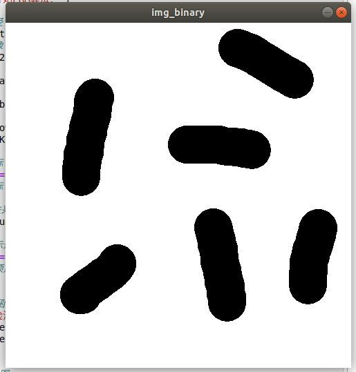
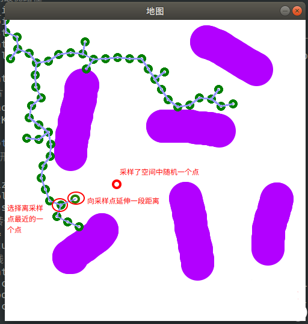
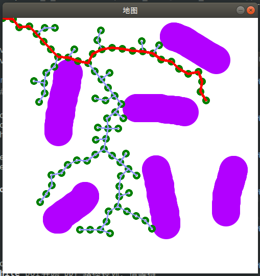
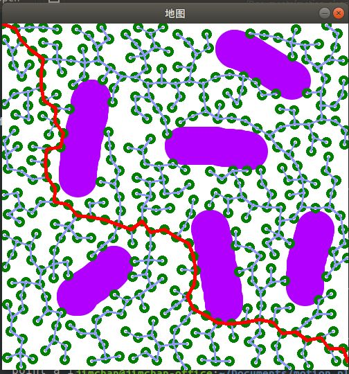
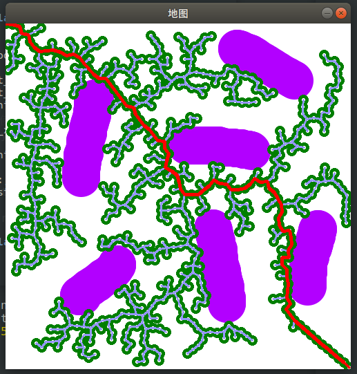
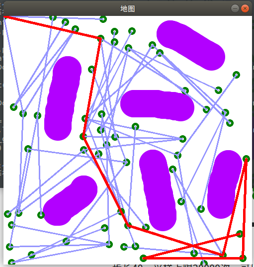

- PRM（Probabilistic Road Map）
- RRT (Rapidly-Exploring Random Trees)快速随机扩展树

###　PRM（Probabilistic Road Map）

## 原理

机器人运动规划的基本任务可以描述为：**从开始位置到目标位置的运动**。这一任务通常涉及到两项基本问题：

1. 如何躲避构型空间中出现的障碍物（几何路径规划）
2. 如何满足机器人本身在机械、传感方面的速度、加速度等限制（不确定性、反馈、微分约束等）

其中，**基于抽样的运动规划算法**是用于解决第 1 个问题的重要方法，其核心思想为：先对机器人的单个构型进行碰撞检测，建立无碰撞构型的数据库，再对不同的构型进行采样以生成无碰撞路径。该算法的优点在于具有通用性，只需要针对不同的机器人运动规划问题进行合理的参数调整。该算法的缺点在于完备性较弱，即当参数设置不合理时，即使存在可行的路径，也不一定能够找到。

典型的抽样规划方法有**综合查询方法**和**单一查询方法**两类。前者首先构建路线图，先通过采样和碰撞检测建立完整的**无向图**，以得到构型空间的完整连接属性。再通过**图搜索**即可得到可行的路径。后者则从特定的初始构型出发局部建立路线图，在构型空间中延伸树型数据结构，最终使它们相连。

本文介绍的**概率路线图（Probabilistic Roadmap，PRM）**属于综合查询方法，其步骤如下：

**预处理：**

1. 初始化。设 G(V,E)为一个无向图，其中顶点集V 代表无碰撞的构型，连线集 E 代表无碰撞路径。初始状态为空。
2. 构型采样。从构型空间中采样一个无碰撞的点 α(i) 并加入到顶点集 V 中。
3. 领域计算。定义距离 p ，对于已经存在于顶点集 V 中的点，如果它与  α(i) 的距离小于 p ，则将其称作点 α(i)  的邻域点。
4. 边线连接。将点 α(i) 与其领域点相连，生成连线 t。
5. 碰撞检测。检测连线 t 是否与障碍物发生碰撞，如果无碰撞，则将其加入到连线集 E  中。
6. 结束条件。当所有采样点（满足采样数量要求）均已完成上述步骤后结束，否则重复2-5。

**搜索：**

采用图搜索算法对无向图G进行搜索，如果能找到起始点A到终点B的路线，说明存在可行的运动规划方案。

## 实现

下面通过python编程予以实现，源代码下载地址：

[https://github.com/XM522706601/robotics_tutorial_for_zhihu/blob/master/PRM_algorithm.pygithub.com/XM522706601/robotics_tutorial_for_zhihu/blob/master/PRM_algorithm.py](https://link.zhihu.com/?target=https%3A//github.com/XM522706601/robotics_tutorial_for_zhihu/blob/master/PRM_algorithm.py)

实现思路如下：

1.先绘制一个500*500像素的bmp图像，用白色表示可行的构型空间，用深色表示障碍区域：

*注释：这里的二维构型空间的横纵坐标可以有多种理解。对于平面型移动机器人，横纵坐标可以表示其在平面上的位置坐标，障碍区域为平面上的不可达区域坐标；对于二自由度的关节型机器人，横纵坐标可以分别表示其两个关节的转角，障碍区域为不可达区域在关节空间的映射。*

图 1 构型空间与障碍区域地图

2.为了便于碰撞检测，我们再把图像变为黑白，使用了opencv中的灰度化函数cvtColor()和[二值化](https://link.zhihu.com/?target=https%3A//baike.baidu.com/item/%E5%9B%BE%E5%83%8F%E4%BA%8C%E5%80%BC%E5%8C%96/1748870%3Ffr%3Daladdin)函数threshold()。

图 2 二值化后的地图

3.构型采样。在图中随机采样一定数量（如50个）的无碰撞点。需要进行碰撞检测check_point()，抛弃与障碍物发生碰撞的点。（**此处绘图仍然采用原地图，但碰撞检测使用的是二值化地图**）

注意：左上角和右下角两个点是规划的起点和终点，在顶点集中的索引为0和1

图 3 随机采样50个无碰撞点

4.邻域计算，边线连接与碰撞检测。对每一个点，取其领域内（例如直线距离在200以内）的所有点进行连线，对连线进行碰撞检测，将结果存放在[邻接矩阵](https://link.zhihu.com/?target=https%3A//blog.csdn.net/qq_30796379/article/details/80152406%23)中。

这里可以看到，由于邻域和碰撞的限制，右上角两个点和其余点不存在合理的连线。

图 4 检测并存储无碰撞的邻域连线

5.A*搜索。采用A*搜索算法对上图进行搜索，找到从左上到右下的最短路径，即为可行的路径规划方案。

图 5 A*搜索得到的最优路径

## 讨论

**1.采样数量的影响**

显然，对同一地图，采样点的数量越多，找到合理路径以及更优路径的概率就越大。但同时，采样点数量越多，计算与搜索时间也会更长。

如果只设置10个采样点，邻域200。可以看到，并不能找到可行路径，这也说明了抽样规划算法存在的完备性弱的问题。


<center>10个采样点，邻域200

而若设置50和100个采样点，虽然都能找到可行路径，但耗时却存在差异。

如果采样点设置为50，耗时1.323s；设置为100，耗时4.663s


<center>50个采样点，邻域200，耗时1.323s


<center>100个采样点，邻域200，耗时4.663s

**2.邻域设置的影响**

邻域的设置影响着连线的建立与检测。当邻域设置过小，由于连线路径太少，可能找不到解；当领域设置太大，会检测太多较远的点之间的连线，而增加耗时。

如果邻域设置为100，找不到解；设置为1000，耗时4.470s，耗时较长


<center>50个采样点，邻域100，找不到解


<center>50个采样点，邻域1000，耗时4.470s


由上述结果可以看到，概率路线图(PRM)方法适用范围很广，对于不同的应用场景，只需要调整相应的参数即可。


但需要注意，抽样方法的完备性很弱，即使空间中存在合理的路径，由于抽样参数的设置问题，也可能无法找到路径；另外，由于抽样过程的随机性，该方法的稳定性也不好，对于同样的问题，前后两次的解也不一样，因此在严格要求稳定性的场合并不适用。

## 项目地址

[https://github.com/XM522706601/robotics_tutorial_for_zhihu/blob/master/PRM_algorithm.pygithub.com/XM522706601/robotics_tutorial_for_zhihu/blob/master/PRM_algorithm.py](https://link.zhihu.com/?target=https%3A//github.com/XM522706601/robotics_tutorial_for_zhihu/blob/master/PRM_algorithm.py)

## 参考文献

[1] Siciliano B, Oussama K. Springer Handbook of Robotics[M]. 2007.

[2] [PRM路径规划算法 - XXX已失联 - 博客园](https://link.zhihu.com/?target=https%3A//www.cnblogs.com/21207-iHome/p/7209954.html)


### RRT (Rapidly-Exploring Random Trees)快速随机扩展树

我们讲到了机器人运动规划中一个比较重要的方法——概率路线图（PRM）方法，并通过编程进行了演示和分析，下面简单回顾如下：

- 机器人运动规划的基本任务为**从开始位置运动到目标位置**
- 主要难点有二：躲避障碍物（**全局约束**）和满足自身运动性能（**微分约束**）
- **抽样规划**是解决全局约束问题的重要方法
- 抽样规划算法分为**综合查询方法**和**单一查询方法**
- 综合查询方法的代表为**概率路线图算法(PRM)**，单一查询方法的代表为**快速扩展随机树算法(RRT)**

本章我们同样用一个例子来讲解快速扩展随机树算法(RRT)算法。

其实RRT算法与PRM算法十分类似，都是通过抽样来在已知的地图上建立无向图，进而通过搜索方法寻找相对最优的路径。不同点在于，**PRM算法在一开始就通过抽样在地图上构建出完整的无向图，再进行图搜索；而RRT算法则是从某个点出发一边搜索，一边抽样并建图**。

与PRM算法相同，RRT算法也是概率完备的：只要路径存在，且规划的时间足够长，就一定能确保找到一条路径解。注意“且规划的时间足够长”这一前提条件，说明了如果规划器的参数设置不合理（如搜索次数限制太少、采样点过少等），就可能找不到解。

## 算法说明

我们可以把RRT算法比较形象地看做“树型算法”。它从一个起始构型（对于二维图，就是一个点）出发，不断延伸树型数据，最终与目标点相连。先放一张规划的结果可能更加便于理解：

图 1 RRT 算法，从左上角出发呈树型向目标点延伸

算法的步骤如下：

**1.初始化**

选择或绘制一张bmp格式的图像，作为规划的构型空间，为了便于进行碰撞检测，将其二值化。选择左上角[0, 0]点作为起始点；右下角[499, 499]作为目标点。

原图像

二值化图像

**2. 随机采样**

我们已经确定了规划的起始点，按道理它需要不断地向着目标点进行生长。但需要注意的是，由于存在障碍物，如果我们让树型一味朝着目标点延伸，则可能会因为“撞墙”而失败。因此，我们采取了一种随机采样方法：在每次选择生长方向时，有一定的概率会向着目标点延伸，也有一定的概率会随机在地图内选择一个方向延伸一段距离，关键代码如下：

```python
# 利用rand()函数在[0,1]区间内随机生成一个数
if np.random.rand() < 0.5:
    # 如果小于0.5，则在图 img_binary 的范围内随机采样一个点
    sample = np.mat(np.random.randint(0, 
                                      img_binary.shape[0] - 1, 
                                      (1, 2)))
else:
    # 否则用目标点作为采样点
    sample = self.point_goal
```

我们每一步让RRT树有0.5的概率直接采样终点向目标点前进，有0.5的概率向地图内任意方向前进。

图 2 随机采样一个点，或直接采样终点，概率各一半

**3.生长点选择与碰撞检测**

从图 2 可以看到，由于每次生长都存在一定的随机性，因此RRT树会逐渐出现许多分支，那么每一步中我们该如何选择要延伸哪个分支呢？这里我们直接选择RRT树中离采样点最近的点，并向其延伸。

假设我们采样了空间中随机一个点，接下来从现有的RRT树中选择离采样点最近的一个点，并向采样点延伸一段距离。假如在这段延伸中没有发生碰撞（碰撞检测），而且新点与现有的所有点的距离大于某个判断阈值（防止生长到RRT已经探索过的位置），则将这个新点也加入RRT树。



**4. 终止条件**

由于我们每次延伸的距离是固定的，所以并不能保证最后一次延伸能够刚好到达终点的位置，更可能的情况是在终点周围来回跳动。因此我们设定一个阈值，假如本次延伸的新点与终点的距离小于这个阈值，我们就认为已经规划成功。

下面是随机采样概率0.5，步长20，采样上限20000次的结果

成功找到路径

## 分析

前面提到，RRT算法是概率完备的，预设参数可能对规划结果造成影响。那么有哪些参数会影响规划效果呢？这里我列举几个：

**随机采样概率：**

我们每一次采样，都有一定概率朝着任意方向走，或朝着终点走。这个概率显然会影响搜索效果。给人最直接的感觉是，随机采样的概率越大，RRT树的分支也就越多，反之则难以发生新的分支。下面我们修改随机采样概率来看看效果。

设随机采样的概率为0.01，采样上限20000次。可以看到，直到达到采样上限也没有成功找到解。这是因为RRT产生分支的概率太小，经历了许多次碰撞才能凭借分支绕过障碍物。

随机采样的概率为0.01，采样上限20000次

设随机采样的概率为1.0，采样上限20000次。可以看到，虽然规划得以成功，但由于生长缺乏方向性，其实是一种“碰运气”式的搜索。RRT树的分支填充了所有空间直至找到目标点。这样的搜索会消耗大量的时间。

随机采样的概率为1.0，采样上限20000次

**生长步长：**

我们的RRT树每一次延伸，都有一个固定的步长。这个步长的设置显然也会影响树的形状。当步长太大时，可能由于太过笨拙而无法成功绕过障碍物；当步长过小时，生长的速度显然会有所减慢（因为同样的距离要生长更多次）。一般来说，空间越复杂，步长越小。这里必须注意的是，生长步长一定要比判断是否为同一个采样点的阈值要大。

步长10，采样上限20000次。可以看到，采样点极其密集，消耗的时间更长。

步长10，采样上限20000次

步长200，采样上限20000次。没有搜索到最终结果，可以看到，由于步长太大，生长点在障碍物与终点之间来回跳动，始终不能满足碰撞检测或终止条件的要求。

步长200，采样上限20000次

## 更多演示

RRT算法的适用性同样很广，举例如下：


## 参考文献：

[1] Siciliano B, Oussama K. Springer Handbook of Robotics[M]. 2007.

[2] [RRT路径规划算法 XXX已失联](https://link.zhihu.com/?target=http%3A//www.cnblogs.com/21207-iHome/p/7210543.html)