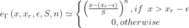
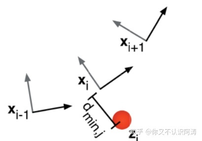
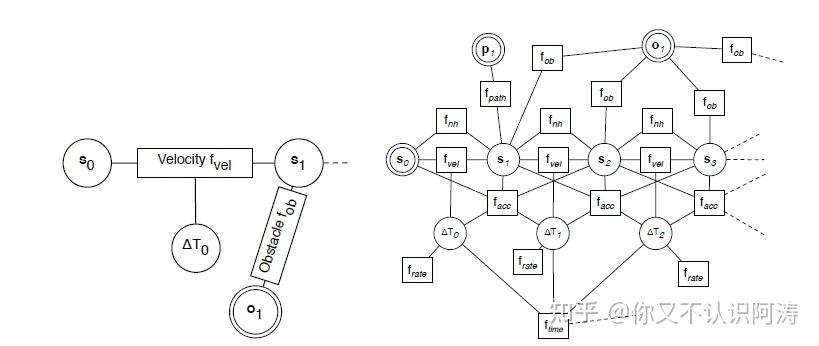
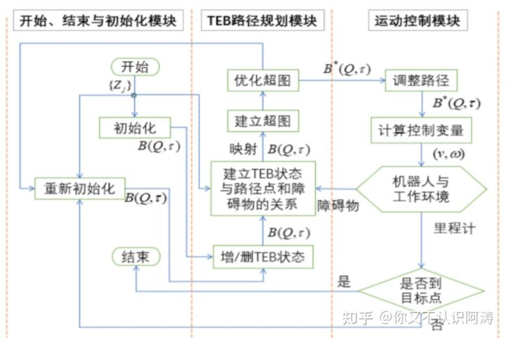
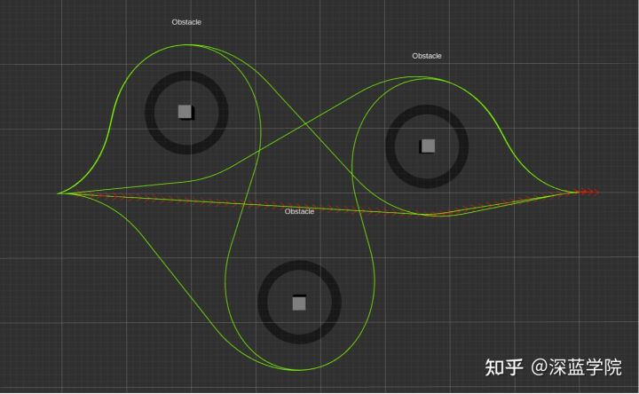

#### Time Elastic Band模型（时间弹性带）

## 1 TEB算法概述

关于eletic band（橡皮筋）的定义：连接起始、目标点，并让这个路径可以变形，变形的条件就是将**所有约束当做橡皮筋的外力**。

关于time eletic band的简述：起始点、目标点状态由用户/全局规划器指定，中间插入N个控制橡皮筋形状的控制点（机器人姿态）；为了显示轨迹的运动学信息，我们在点与点之间定义运动时间Time，即为Timed-Elastic-Band算法。

**注意：**

- 机器人的姿态指的是机器人坐标和朝向，称之为configuration;引入Time的概念，保证机器人运动是实时的，在一定时间内完成。
- Time Elastic Band算法把路径规划问题描述为一个**多目标优化问题**，即对最小化轨迹执行时间、与障碍物保持一定距离并遵守运动动力学约束等目标进行优化。因为优化的大多数目标都是局部的，只与机器人的某几个连续的状态有关，所以该优化问题为对稀疏模型的优化。
- **求解稀疏模型多目标优化问题**，可通过构建超图（**hyper-graph**），使用**g2o**（通用图优化）框架中关于大规模稀疏矩阵的优化算法来求解。机器人状态和时间间隔作为nodes，目标函数和约束函数作为edges，各nodes由edges连接构成hyper-graph。在该hyper-graph中，每个约束为一条edge，且每条edge允许连接的nodes的数目不受限制。
- Time Elastic Band算法通俗的解释：从给定路径中得到一系列带时间信息的离散位姿（pose），通过图优化的方法将这些离散位姿组成满足时间最短、距离最短和远离障碍物等目标的轨迹，同时满足机器人运动动力学的约束。需要注意的是，优化得到的轨迹并不一定满足所有约束，即给定的约束条件实际上都是**软约束条件**。

**优点：**

- **适用于各种常见车模**：如差分、全向、阿克曼模型
- **有很强的前瞻性：** 对前方一段轨迹进行优化
- **动态避障效果好：** 对动态障碍有较好的避障效果，可直接使用其封装好障碍类Obstacle

**缺点：**

- **计算复杂度较大**：可通过牺牲预测距离来降低复杂度
- **速度和角度波动较大、控制不稳定：** 源码中是通过两状态之间的距离和角度差及时间差来计算该控制周期内的速度和角速度，使得在控制过程中速度和角度波动较大。
- **非全局最优：** 但是优于DWA

## 2 Time Elastic Band模型

**想要弄清TEB算法的原理以及整个流程，首先弄清楚插入的N各控制点是什么？Time是什么？通过TEB算法处理后最终得到什么？**

经典的“elastic band”使用*n*个机器人的中间位姿

的序列来描述。其中xi 、 yi 、βi分别对应机器人在map坐标系（或者世界坐标系）的位置和姿态，文章中称其为configuration。

两个configuration间的时间间隔定义为△Ti，记录时间序列：

将configuration及时间序列合并：

通过加权多目标优化获取最优的路径点，即最优的Q：

其中B*表示优化后的TEB， f(B) 表示目标函数。在本文中，它是包含各个方面的分量fk(B)的加权和。

作者在撰写论文时ROS对稀疏矩阵优化问题的支持并未十分完善，故作者采用分段连续，可微分的代价函数计算破坏约束的惩罚值。

其中为xr 极限值， ε 、S、n影响近似的准确度。具体地说，S表示缩放，n表示多项式阶数，ε 表示限界值附近一个小位移。

**通过上述的介绍，可以知道加入的N个控制点就是机器人的多个configuration，Time就是configuration之间的时间间隔，通过TEB算法的处理，最终得到一些列满足各种限制条件（速度限制、加速度限制、远离障碍物，符合全局路径等）的configuration和Time的集合。**

## 3 约束目标函数

**关于各个约束条件，分别阐述如下，在理清楚各个约束条件后，就可以通过优化的方法得到configuration和Time的集合。**

### 3.1 Way points and obstacles

TEB在进行路标点跟踪的同时，还要避免撞到静态或动态障碍物。这两个目标函数的不同之处在于Way points吸引“elastic band”而障碍物排斥“elastic band”。目标函数取决于“timed elastic band”和Way points或障碍物之间的zj 之间的最小距离 dmin,j，如下图所示。对于Way points这种情况，距离从上界以最大目标半径 r_pmax约束；对于障碍物这种情况，距离从下界以最小距离 $r_{o_{min}}$约束。

约束以惩罚函数实现：

值得注意的是，目标函数的梯度可视为对elastic band施加的外力。

### 3.2 速度和加速度

由速度和加速度组成的动力学约束可以用3.1中运动学约束的惩罚函数表示。机器人运动的平均线速度和角速度可以通过相邻的configuration：xi，x_(i+1)和时间间隔 △T 计算得到。

类似的，线速度约束可以表示为：

同理，角速度约束也可以得到。

### 3.3 运动学约束

差动机器人在平面运动只有两个自由度，其只能以朝向的方向直线运动或旋转。这种运动学约束使得机器人以有若干弧段组成的平滑的轨迹运动。相邻的两个configuration应在弧段的两端，如下图所示：

初始configuration xi与运动方向 di,i+1的夹角 $\theta_i$ 与下一状态的$\theta_{i+1}$相等。若$\beta_i$为机器人在第i段弧段相对于世界坐标系的绝对姿态，则有：

其中，运动方向向量为：

相应的目标函数：

### 3.4 最快路径约束

目标函数即为最小化时间间隔序列的二次方。

目标函数使得机器人获得最快路径，路径上的各configuration点在时间上均匀分开，而非传统的空间上求最短路径。

## 4 优化问题

**我们理清configuration、Time等概念，并且理清楚各种约束条件后，我们通过构建hyper-graph进行求解。**

使用开源框架g2o进行优化：点（node）&边（edge）;

g2o:General Graph Optimization通用图优化法

TEB算法就是求解configuration和Time和集合问题，也就是多目标优化问题，可通过构建超图（hyper-graph），使用g2o（通用图优化）框架中关于大规模稀疏矩阵的优化算法来求解。机器人状态和时间间隔作为nodes，目标函数和约束函数作为edges，各nodes由edges连接构成hyper-graph。在该hyper-graph中，每个约束为一条edge，且每条edge允许连接的nodes的数目不受限制。TEB hyper-graph如下图所示：

## 5 TEB算法实现流程

全局路径——>加入约束——>g2o优化——>速度指令

## 参考文献

《Trajectory modification considering dynamic constraints of autonomous robots》

#### HyperGraph

超图 : hyperedge（超边），超边可以和任意个数的顶点连接，普通的图1条边只能连接两个点

这里每个约束为1条Edge：???

## **算法原理概述**

本文依据Christoph Rösmann在论文中的描述，对eletic band进行定义：将给定的路径视为受内外力影响的弹性橡皮筋，使其变形，而内外力相互平衡，使路径收缩，同时与障碍物保持一定的距离，其中内外力就是对机器人运动的所有约束。而对于time eletic band，则在给定路径中间插入N个控制橡皮筋形状的控制点（机器人姿态），在点与点之间定义运动时间Time，即为Time Elastic Band算法。

通过上述定义我们可以看出，Time Elastic Band算法把路径规划问题描述为一个多目标优化问题，即对最小化轨迹执行时间、与障碍物保持一定距离并遵守运动动力学约束等目标进行优化。因为优化的大多数目标都是局部的，只与机器人的某几个连续的状态有关，所以该优化问题为对稀疏模型的优化。通过求解稀疏模型多目标优化问题，可以有效获得机器人的最佳运动轨迹。

求解稀疏模型多目标优化问题，可通过构建超图（hyper-graph），使用g2o（通用图优化）框架中关于大规模稀疏矩阵的优化算法来求解。机器人状态和时间间隔作为nodes，目标函数和约束函数作为edges，各nodes由edges连接构成hyper-graph。在该hyper-graph中，每个约束为一条edge，且每条edge允许连接的nodes的数目不受限制。

Time Elastic Band算法通俗的解释就是从给定路径中得到一系列带时间信息的离散位姿（pose），通过图优化的方法将这些离散位姿组成满足时间最短、距离最短和远离障碍物等目标的轨迹，同时满足机器人运动动力学的约束。需要注意的是，优化得到的轨迹并不一定满足所有约束，即给定的约束条件实际上都是软约束条件。

## **算法演示与讲解**

通过阅读teb_local_planner的源码，我们可以知道teb_local_planner提供了许多参数和权重的配置接口，让用户可以为优化问题提供参数和权重，在不同的约束条件下指定优化目标。下面我们通过对teb_local_planner实现效果的简单演示来加深对Time Elastic Band算法的理解。

前面提到，Time Elastic Band算法可以在给定路径的基础上对轨迹进行优化，实现最小化轨迹时间、与障碍物保持距离等目标。

其中，与障碍物保持距离可以说是一个路径规划算法比较重要的功能，teb_local_planner提供了min_obstacle_dist和inflation_dist两个参数以及相应的权重，使用户可对轨迹与障碍物的距离进行调整，以此来满足不同环境下路径规划的需求。以下为配置不同参数值时，teb_local_planner规划出的不同的轨迹（为了使演示的效果更加明显，参数权重给得比较大）：

说到这里，可能也有小伙伴发现了，在上面演示的过程中，teb_local_planner并不仅仅规划出一条路径，而是从多条路径中选取最优轨迹，这就不得不提到teb_local_planner中的Homotopy Class Planner，用户可以将enable_multithreading参数设置为True来开启同时规划多条路径，并从中选取最优轨迹。下面我们也来看一下只规划一条轨迹与同时规划多条路径并选取最优轨迹的对比：

只规划一条轨迹

同时规划多条路径并选取最优轨迹

从上面的对比可以看出，在某些极端条件下，同时规划多条路径并选取最优轨迹得到的轨迹更符合全局最优，也更合理。当然，同时规划多条路径也将消耗更多的机器性能。在实际应用过程中，用户应当根据具体情况合理取舍。

## **总结**

通过上面的介绍，可以看出Time Elastic Band算法有很多的优点，可以满足时间最短、距离最短和远离障碍物等目标以及满足机器人运动动力学的约束。那是不是Time Elastic Band算法就没有缺点呢？答案是否定的。

从前文我们可以知道，Time Elastic Band算法的大多数约束都是软约束条件。若参数和权重设置不合理或者环境过于苛刻，都有可能导致Time Elastic Band算法规划失败，出现非常奇怪的轨迹。因此，teb_local_planner中包含了检测冲突的部分，判断轨迹上的点是否与障碍物存在冲突，此时需要考虑机器人的实际轮廓。

在实际的开发过程中，更多地需要考虑机器人自身其他模块的性能，例如电机能够提供的最大加速度，定位算法的精度等，同时也要考虑具体的环境以及选择Time Elastic Band算法是否合理，如此才能将其性能发挥出更好的效果。

在本文中，我分享了我对Time Elastic Band算法的一点理解，但毕竟认知有限，对算法的部分内容的理解还是比较粗浅的，望大家多多包涵，有什么问题也希望能够与大家多交流。在后续的文章中，我会分享ROS自主移动机器人的开发以及各类算法的应用，有机会的话也会对Time Elastic Band算法的原理进行更加深入的解析，希望大家多多支持。

https://github.com/rst-tu-dortmund/teb_local_planner