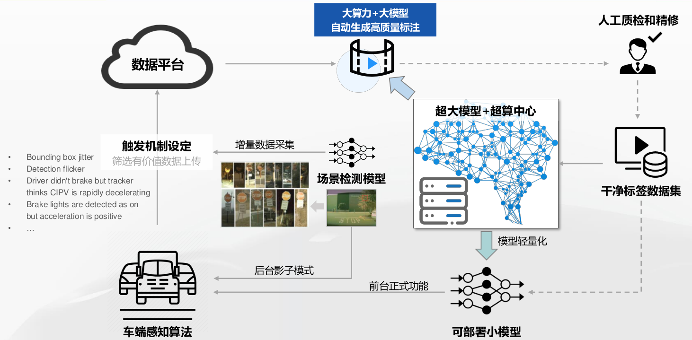

1. 大模型：参数个数非常多（参数级别在亿以上）
2. 参数：模型训练得到的参数
3. 超参数：训练模型的过程中，所设置的参数
   - 典型超参数：模型参数个数，学习率（迁移学习），模型的层数，模型的结构
4. 模型迁移：你已经有一个能分类足球、篮球、排球的大模型，基于这个模型，你去训练一个世界杯足球的识别，就会很容易
5. 模型泛化：触类旁通的能力
   - 泛化能力比较弱：训练的时候只给他看世界杯的足球，最终的模型：普通的足球都不认识，这种又称过拟合
   - 泛化能力比较强：无论是白天还是黑夜，无论这个足球是新还是旧，都能识别出来。见过三文鱼寿司、肉松寿司，遇到青瓜寿司也能识别称寿司。