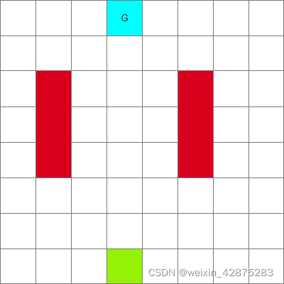
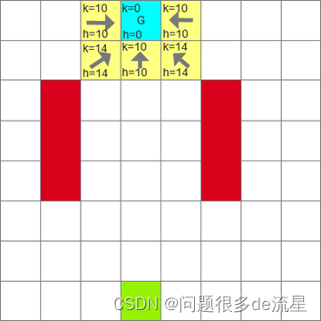
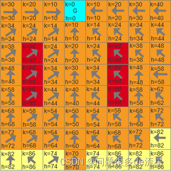
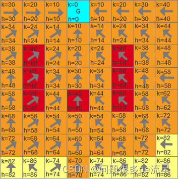
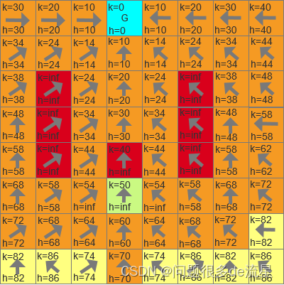
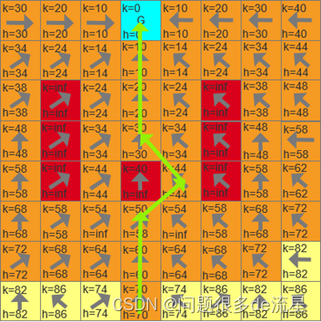

## D* (Dynamic A*)

一、D*算法是什么？
D*算法也是用于机器人路径规划问题的启发式方法，它是一种局部规划方法，即仅仅已知一部分地形，对地形的未知部分进行假设，并在这些假设下找到当前坐标到目标坐标的最短路径。然后机器人沿着这条路走，当它观察到新的地图信息（如从前未知的障碍）时，将这些信息添加到地图中，并在必要时重新规划从当前坐标到给定目标坐标的新的最短路径。重复这个过程，直到达到目标坐标或无法达到目标坐标。

二、原理以及代码步骤
1.原理分析

如上图的空间，给定起点（绿色点）、目标点（G蓝色）、障碍（红色），如何进行路径规划？

首次搜索
将终点G置于openlist中，采用Dijkstra进行搜索，规定上下左右的代价为10，斜着方向的代价为14。不熟悉Dijkstra算法的朋友看我之前的博文Dijkstra算法在python中的实现。
大概说一下，每个格子包含有三个量（节点名，代价，父节点），从终点A开始，搜索周围的邻节点，给它们分别标号：B,C,D,E,F，代价按照规定的计算（上下左右的代价为10，斜着方向的代价为14），并把终点A放入close list里面（不再遍历）。然后找出代价最小的节点作为新节点，继续搜索，在搜索过程中，如果有节点K已经有代价，但是以新的点为父节点，这个节点K的代价值更小，那么更新其代价值和父节点。

搜索结束条件就是终点从openlist中弹出进入了closelist。
最终，我们搜索到了起点，结束搜索。从起点开始找父节点，一路搜索到终点。
#### 遇到障碍
如果机器人在按照原来规划路径行进的时候，路上遇到障碍（不在规划路径上的障碍忽略不计）。例如（3，3）遇到障碍。

修改这个点的h值为无穷大（inf），并且令障碍的所有子节点的h都为无穷大。

图中浅绿色节点是路径上障碍的子节点X，子节点X的h变为inf，将节点X从closelist中弹出，放入openlist列表。
接下来就是将这个改变进行扩散。

先取出openlist中k值最小的节点，还是浅绿色节点X（k=50,h=inf）
找X的周围邻接点Y，如果能够让X的h值变小，就让Y成为X的父节点，这样X（3，2）的父节点变为（4，3），hx变为58，此时X的子节点如（3，1)，而hx+10(x和y的代价)不等于hy(60)，说明障碍的影响没有扩散到子节点，所以更改子节点（3，1）的h值为hx+10。
因为（4，3）节点到目标点的路径其实是之前计算过的，所以不必计算。
**扩散的结束条件就是k_min(openlist中所有节点最小的k值)>=hx(当前点X的h值)。**
就能找到一条路径：

