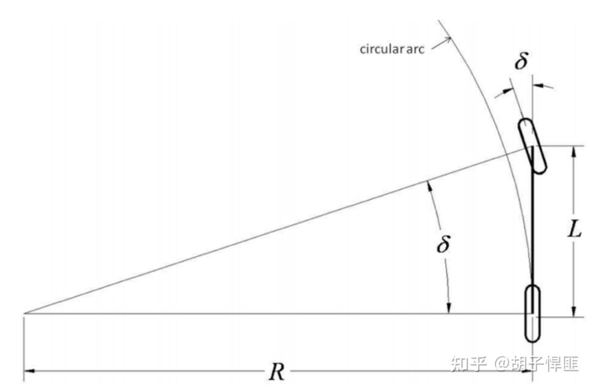
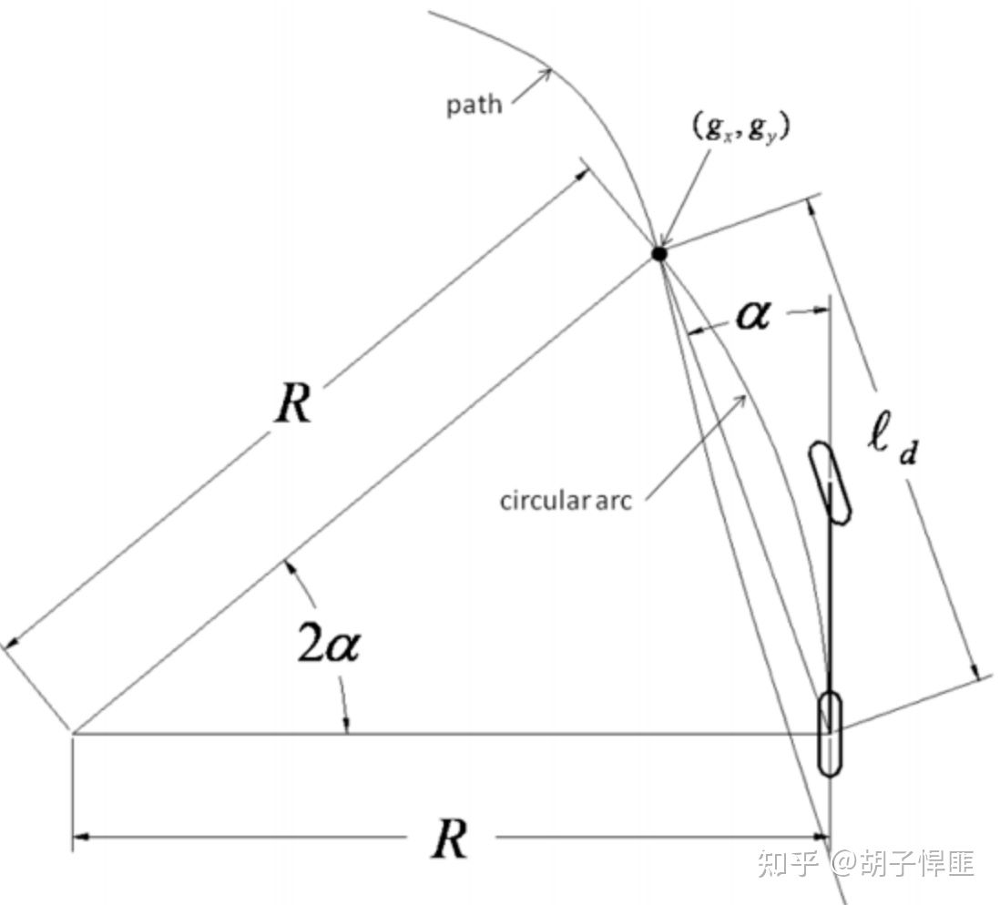

#### Pure Pursuit

首先感性的去认识一下纯追踪算法，简单理解就是，无人车关注轨迹中某个点目标goal，然后去追踪它。

在无人地面载具（UGV）场景下，这里的goal是Planning子系统所规划轨迹上的一些点，称为路点（Way Points）。如果轨迹是连续的，就在轨迹上采样多个点。如果轨迹是离散的，那么就可以直接使用。

上图是一个自行车模型，接下来简单说明是怎么绘制的。车辆坐标原点在后轴中心，如果转向角δ确定以后，车辆会以某个圆心做一个转圈动作，这个圆的半径就是R。那么pure pursuit算法就是一个横向控制器，通过计算转向角δ来控制车辆，使得车辆后轴中心能沿着轨迹移动。

各变量含义如下：

δ：前轮的转向角

L：轴距

R：给定转向角后，车后轴中心的圆半径

根据图中关系可得
$$
tan\delta=\frac{L}{R}
$$
（1）式的δ是我们要求的转向角，而未知量式R。由于曲率k与半径R呈倒数关系可将（1）式改写为
$$
\delta=arctan(kL)
$$
这时求解δ就成为了，解等式右边式子，其中L已知，是车辆的轴距，未知量是曲率k。接下来我们就来求解这个k。

上图便是pure pursuit算法的几何图形，简单说明一下怎么绘制的。其中点g是我们的目标路点，我们要确定转向角δ（**注意，不是图中的α**），使后轴中心遵循的圆弧能经过g。**再次强调，我们要求是圆弧的半径R，或者说曲率k，上图中的未知量只有R**

各变量含义如下

g- 目标路径点

α：偏航角

ld: 前视距离

接下来推导怎么求曲率k
$$
\frac{l_d}{sin(2\alpha)}=\frac{R}{sin(\pi/2-\alpha)}
$$
$$
\frac{l_d}{sin(alpha)}=2R
$$

考虑时间t，可以将（2）式表示为
$$
\delta(t)=arctan(k(t)L)=arctan(\frac{2Lsin(\alpha(t))}{l_d})
$$
至此，pure pursuit算法就变成了每一个时刻求解α。

pure pursuit算法主要参数是前视距离ld，对算法的性能影响很大。现在采取的通用方法是令前视距离ld是与速度有关的参数，不同的速度对用不同的前视距离。

可以看出，pure pursuit 算法对直线追踪效果还可以。在直线路径上，一般经过1-2个点的调整，就可以很好的跟踪直线。

在曲线路径，算法的原因，车在接近目标点时，哪怕以很慢的速度，但距离只要在预瞄距离以内，小车就更新预瞄点为下一个，这样导致的情况是，小车还没到达预瞄点（距离大概在预瞄距离处时，小车便更换了预瞄点，导致对曲线路径没法做到100%的跟踪效果。