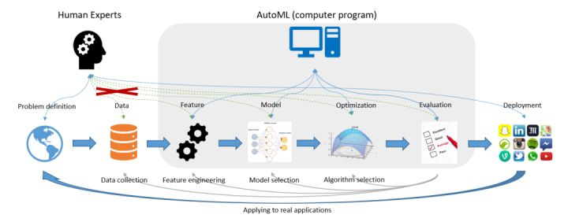
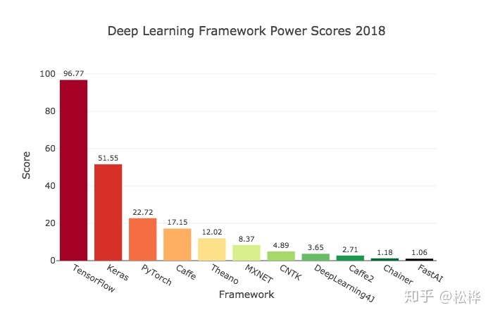

**AutoML（Automated Machine Learning，自动化人工智能）**

导读：近期在学习研究一些关于自动化机器学习方面的论文，本文作为该系列的第一篇文章，就AutoML的一些基本概念和现状进行简单分享，权当抱砖引玉。

图片源自《Taking Human out of Learning Applications: A Survey on Automated Machine Learning》2018

在算法行业有这样一句话，大意是说80%的时间用在做数据清洗和特征工程，仅有20%的时间用来做算法建模，其核心是在说明数据和特征所占比重之大。与此同时，越来越多的数据从业者们也希望能够降低机器学习的入门门槛，尤其是降低对特定领域的业务经验要求、算法调参经验等。基于这一背景，AutoML应运而生。

如何理解AutoML呢？从字面意思来看，AutoML即为Auto+ML，是自动化+机器学习两个学科的结合体；从技术角度来说，则是泛指在机器学习各阶段流程中有一个或多个阶段采取自动化而无需人工参与的实现方案。例如在本文开篇引用的AutoML经典图例中：其覆盖了特征工程（Feature Engineering）、模型选择（Model Selection）、算法选择（Algorithm Selection）以及模型评估（Model Evaluation）4个典型阶段，而仅有问题定义、数据准备和模型部署这三部分工作交由人工来实现。

AutoML，与其说是一项技术，不如称之为一种思想：即将一门学科的技术（自动化）引入另一门学科（机器学习）的思想。所以从某种角度来说，AutoML本不是什么新鲜技术，也并见得需要创新性突破可言。那是什么促使其诞生并盛行于当下呢？原因主要有三：

- 数据从业者的懒惰。俗话说，懒惰是人类进步的源动力，这一点在AutoML这件事上体现的淋漓尽致。因为数据从业者们渴望从繁杂冗长的数据清洗、特征工程以及调参炼丹的无趣过程中解脱出来，自然而然的想法就是希望这一过程能够Auto起来！当然，这一过程也可正面解读为对技术精进的不懈追求……
- 对降低ML入门门槛的期盼。毫无疑问，以机器学习为代表的AI行业是当下最热门技术之一，也着实在很多场景解决了不少工程化的问题，所以越来越多的数据从业者投身其中。但并不是每名算法工程师或者数据科学家都有充分的业务经验和炼丹技巧，所以更多人是希望能够降低这一入门门槛，简化机器学习建模流程。
- 足够的数据体量和日益提升的算法算力。客观来讲，没有足够的数据量谈Auto是不切实际的，因为不足以学到足够的知识以实现Auto；而另一方面，AutoML的实现过程其实充满了大量的迭代运算，所以完成单次的AutoML意味着约等于成百上千次的单次ML，其时间成本不得不成为AutoML领域的一个不容忽视的约束条件，而解决这一问题则一般需依赖优秀的算法和充足的算力。

上面介绍了AutoML的产生原因，其实是回答了Why的问题。与Why相对应的一般就是What和How的问题。那么AutoML是What呢？当然，这里不打算用开篇图例中的模块来讲解What的问题，而是用人话来说说AutoML当下的几个热点：

- 模型选择（Model Selection）以及超参优化（HPO）。这两个阶段可能是AutoML里最早涉及和最为关键的技术，早期的AutoML产品/工具其实也是主攻这两个方向，例如Auto-WEKA和Auto-Sklearn就都是以这两方面的实现为主。其中模型选择其实主要还是枚举为主，即将常用的模型逐一尝试而后选出最好的模型或其组合。而HPO则相当于是加强版的GridSearch，都是解决最优超参数的问题，只是解决的算法不同罢了，其中基于贝叶斯的超参优化是主流。
- 自动化特征工程（AutoFE）。AutoFE是解决原始特征表达信息不充分或者存在冗余的问题，相应的解决方案就是特征衍生+特征选择，而AutoFE一般是考虑这两个过程的联合实现抑或加一些创新的优化设计。
- 元学习（Meta Learning）和迁移学习（Transfer Learning）。前面提到的模型选择，虽然多数产品都是对候选模型进行枚举尝试，但也有更为优秀的实现方案，那就是元学习。例如Auto-Sklearn中其实是集成了元学习的功能，在处理新的数据集学习任务时可以借鉴历史任务而会自动选择更为可能得到较好性能的模型，这个过程也称之为warn-start。如果说元学习适用于经典机器学习算法，那么迁移学习其实则主要适用于深度学习技术：通过对历史任务的学习经验对后续类似场景的神经网络架构设计提供一定的先验信息。
- 神经网络架构搜索（NAS）。同样是针对深度学习的神经网络架构，当没有任何经验可供迁移时，那么如何设计和构建神经网络架构就是一个需要慎重考虑的问题。对此的解决方案即为NAS——neural architecture search！

简单说完Why和What的问题之后，介绍How的问题就不那么简单了。这本身是一个需要持续理解和不断精进的过程，如果现在来说也只能描述的主流产品一级：Auto-WEKA、Hyperopt-Sklearn、Auto-Sklearn、TPOT、H2O、AutoGluon……这份清单其实可以罗列几十种，遍布国内外。

-----

其中数据预处理与模型优化部分往往需要具备专业知识的数据科学家来完成，他们建立起了数据到计算的桥梁。

然而，即使是数据科学家，也需要花费大量的精力来进行算法与模型的选择。

机器学习在各种应用中的成功，导致对机器学习从业人员的需求不断增长，因此我们希望实现真正意义上的机器学习，让尽可能多的工作也能够被自动化完成，进一步降低机器学习的门槛，让没有该领域专业知识的人也可以使用机器学习来完成相关的工作。

AutoML应运而生。

从传统机器学习模型出发，AutoML从特征工程、模型构建、超参优化三方面实现自动化；并且也提出了end-to-end的解决方案。本专栏，贯彻AutoML的思想，将门槛降到最低，简略介绍原理，侧重介绍AutoML开源工具的使用方法。本篇文章主要对AutoML各个工具的优劣特性进行总结对比，关于AutoML各个工具的详情见专栏中细分文章。

## 一. 特征工程

### **1.什么是特征工程**

**特征**是从现实世界的具体物体到用数值表示的抽象数值化变换。

**特征工程**是将原始数据转化为特征的过程，这些特征可以更好地向预测模型描述潜在问题，从而提高模型对未见数据的准确性。

**特征工程**通常包括三个工作：特征生成、特征选择、特征编码

- **特征选择** 在许多数据分析和建模项目中，数据科学家会收集到**成百上千个特征**。更糟糕的是，有时特征数目会大于样本数目。这种情况很普遍，但在大多数情况下，并**不是所有的变量都是与机器试图理解和建模的内容相关**的。所以数据科学家可以尝试设计一些有效的方法来**选择**那些重要的特征，并将它们合并到模型中，这叫做特征选择。
- **特征生成** 一般是在特征选择之前，它提取的对象是**原始数据**，目的就是自动地构建新的特征，**将原始数据转换为一组具有明显物理意义（比如 Gabor、几何特征、纹理特征）或者统计意义的特征**。
- **特征编码** 原始数据通常比较杂乱，可能会带有各种非数字特殊符号。**而实际上机器学习模型需要的数据是数字型的，因为只有数字类型才能进行计算。**因此，对于各种特殊的特征值，我们都需要对其进行相应的编码，也是**量化**的过程。

### **2 .为什么需要自动特征工程**

在机器学习步骤中，特征工程会耗费数据科学家大量的人力去进行特征的提取和筛选，不仅耗费大量的时间，而且效率也不高。因此需要自动特征工程来将这些操作自动化，节省数据科学家的时间。

## **二、模型构建**

此处模型构建特指深度学习框架，关于深度学习框架的介绍不在本专栏的调研范围内，因此我们只简要对深度学习框架做一个简单对比。

深度学习框架链接起了整个AI生态：上层算法应用基于框架搭建，底层芯片入口适配框架开发。2018年9月，Jeff Hale根据公司招聘、调研报告、网络搜索、科研论文、教程文档、GitHub热度等数据，[评估了2018年11种深度学习框架的影响力](https://link.zhihu.com/?target=https%3A//towardsdatascience.com/deep-learning-framework-power-scores-2018-23607ddf297a)，如下图所示。

## 三、超参优化工具总结

### 1.什么是超参数优化

**超参数**是机器学习在学习之前预先设置好的参数，而非通过训练得到的参数，例如树的数量深度， 神经网络的学习率等，甚至在超参学习中神经网络的结构，包括层数，不同层的类型，层之间的连接方式等，都属于超参数的范畴。

手动修改调参既耗费大量的人力和时间，同时也难以寻找优化的方向，而对超参数选择进行优化既能节省大量人力和时间，又能让学习获得**更好的性能和效果**。因此出现了一系列的超参优化的工具来简化和改进超参选择和调整的过程。