#### ADASIS (ADAS Interface Specifications)

ADASISv1

- 这个初始版本旨在根据车辆当前位置和地图数据解释道路几何与车辆前方的所有相关属性。ADASIS系统原型和接口规范已经在PReVENT MAPS&ADAS子项目的范围内进行了测试和验证。在测试中，ADASIS概念的协同性、可行性和性能被证明是成功的。但是，ADASISv1仅能支持车辆前方的单一路径，且被认为对于主机厂的实际开发和生成环境来说界面太过复杂。因此，没有任何应用。

ADASISv2

- 根据从ADASISv1中汲取的经验教训，第二版已通过更复杂的软件进行了简化和增强，使得ADAS Horizon数据的解释和重建变得更加容易。此外，ADASISv2旨在描述多条路径，包括一条主路径和多条子路径。主路径表示最可能路径（Most Probable Path - MPP），它是使用优化路径表示生成的。当客户端（ADAS应用程序）需要Horizon数据时，将传输包含具有多个路径的网络描述的完整范围。这种方法有助于减少数据的重复并为数据客户提供优势。当车辆偏离主路径时，车辆最可能的驾驶方案，ADAS Horizon的结构算法将立即指示车辆到达First-Level的子路径，这是第二个最可能的路径。这个过程可以在每个客户端进行，因为他们已经可以获得完整的地平线。

ADASISv3

- 新版ADASIS标准侧重于自动驾驶。主要增强功能包括更高的分辨率（厘米级）、多个道路网络表示树、详细的车道和线条几何图形，以及其他属性（例如，地标，道路边界等）。此外，它能够在一个消息中传输更多数量和类型的属性简档及更长的路径，以支持自动驾驶的不同方面，例如高精地图和更新的动态地图数据。ADASISv3可以通过自动驾驶系统处理多个AHP。因此，它将使自动驾驶汽车更具灵活性。ADASISv3目前仅适用于ADASIS会员，计划于2019年中公开发布。可以密切关注。

- 电子地平线（ADAS Horizon，eHorizon等）是指包含ADAS应用程序所需的所有ADAS属性的地图数据，尤其是车辆当前位置附近的属性。

ADASIS协议介绍

ADASIS协议中定义的架构中包括（如图1）：

- **ADAS Horizon Provider：**ADAS地图提供商，此处ADASIS定义的Horizon可以理解为是基于原始地图分析计算而得到的一种数字地图模型,是一个比较广义的概念，并非狭义的视野或地平线。
- **ADAS Protocol：**ADAS通信协议
- **ADAS Application**(ADAS Reconstructor：ADAS应用中用于接收、解析数据的组件）：ADAS应用，负责数据的接收和应用

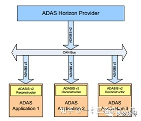图1 ADAS v2系统架构

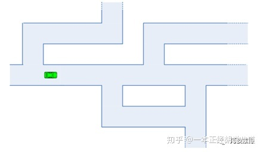图2 道路的网络结构视图

在数字地图的数据库中，所有的道路都是通过链路（lines）、节点（nodes）进行连接和组合来表示的，这些组合起来的网络拓扑结构即表示现实世界中的道路模型。如图2，这个网络结构可以将复杂的道路环境简化为简单的抽象视图，同时可以更加准确的表示出道路的属性。

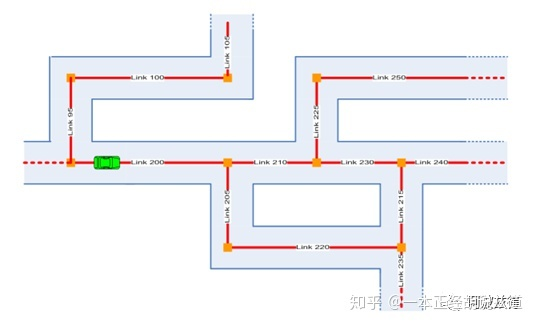图3 车辆附近道路链路图

对于ADAS应用，最重要的信息是车辆当前位置周围的道路环境，也就是未来车辆在道路中最可能到达的前方位置。ADAS Horizon指的就是数字地图中包含车辆前方道路链路的那一部分。

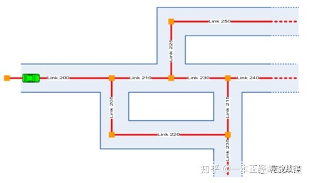图4 ADAS Horizon道路链路图

简单对比上面图3的车辆附近道路链路图和图4的ADAS Horizon道路链路图，可以看到ADAS Horizon并不包含链路95、100、105，因为这部分位于车辆后方，并不属于ADAS Horizon的解析范围。除此之外ADAS Horizon并不能涵盖数字地图中的所有道路的连接关系或属性。例如：ADAS几乎不需要街道的名称或者门牌号码范围。也就是说，ADAS Horizon会给予路径来表示车辆周围环境，并且这是专门针对ADAS应用进行了优化的。另外，对于ADAS Horizon中不同结构的算法不在这个文档中进行描述。ADAS Horizon可以在数字地图中创建抽象的链路。如图4，对于ADAS应用来说，通过分析整个道路的链路网络图来获取车辆前方道路的特征或属性是相当复杂的。举个例子，如果车辆将链路235作为目标，则ADAS应用必须识别链路200→210→230→215→235或200→205→220→235这两条都可以到达目标位置的路线。实际上ADAS应用直接识别车辆未来可能遵循的行驶路线会更简单一些。ADAS Horizon提供商根据地图数据库中链路和链路之间的连接关系来创建路径，每条路径都应是相互独立的。

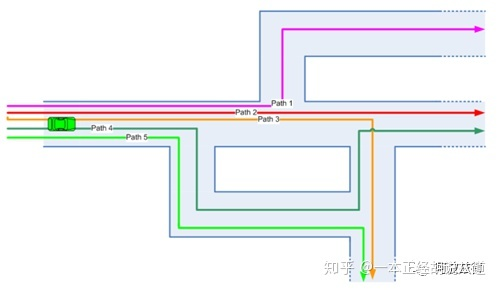图5 ADAS Horizon 路径示意图

回到最开始的示例，通过查询路径特征，ADAS应用已经可以轻松识别路径3和路径5中某个特定的目标了。它或许无法判断这两条路径中的目标是否是同一个目标，但这些信息对于大多数ADAS应用来说并不重要，唯一重要的信息就是前方目标与车辆当前位置的距离。如图5，完整的路径表示中包含了很多冗余信息。例如，路径1、2、3、4、5都有一个共同的起点，如果ADAS Horizon通过低速通信信道进行传输通讯的话，则信息传输的效果会因为冗余信息占用过多带宽而不太理想。ADASIS中的优化路径表示方法会减少类似冗余信息，但无法完全消除冗余的信息。ADASIS中用一种优化路径的方法来表示ADAS Horizon，这种方法不仅减少了冗余信息的数据量，而且仍保留了ADAS Horizon道路网络路径表示方法的大部分优势。为了最简化的使用此方法来表示路径，只需要保留一条根路径即可。车辆可以由根路径转向子路径，比如图6中的路径2为根路径，路径1、3、4均为路径2的子路径。车辆可以由当前路径转向更高一级的子路径，即车辆可以从第一级子路径转向第二级子路径，也可以由第二级子路径转向第三级子路径，以此类推。ADAS Horizon的算法应计算出车辆继续行驶最可能遵循的路径并将其作为根路径，其次可能的是第一级子路径，以此类推。大多数ADAS应用都会首选车辆当前所在的路径为根路径，如果在创建此路径后，根据得到的数据信息判断车辆未来可能会转向子路径，则ADAS应用会偏向于将该子路径作为根路径。所以优化路径是车辆行驶路线中所有分支中某些路径的组合，而并非道路分支中某条固定的路径。

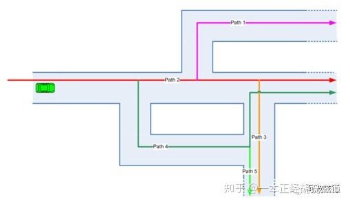图6 ADAS Horizon 优化路径示意图

由于ADASIS使用优化路径方式来表示ADAS Horizon，因此我们将这种表示方法称为ADASIS Horizon。

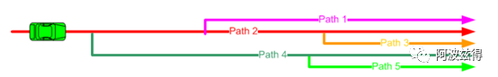图7 ADAS Horizon 应用视图

如图7，从ADAS应用的角度来看，车辆位于根路径（路径2）上，并且车辆要么是顺着这条根路径一直行驶，要么是以位于根路径与某个子路径的交叉路口为目标行驶。

------

https://blog.csdn.net/zyq880625/article/details/123742297

# 一、Introduction

一般，如果是人驾驶车辆，用基本的导航地图（sd map）就可以了，精度大约在10m左右；从ADAS开始，会加入一些辅助驾驶的功能（让车辆自主驾驶），这对于道路感知的要求就会比较高，ADAS地图需要解决该问题，因而ADAS地图的精度要求在1m左右。而对于未来的全自动驾驶驾驶，对地图的精度要求会进一步提高达到分米级（高精度地图）。随着精度的逐步提升，地图的数据量也在逐步上升，因此需要有一套高效、标准的通信协议来规范地图同汽车软件之间的数据传输。

截止到2017年，ADASIS有52个成员单位，其中OEM 16个（中国只有一汽），ADAS 供应商有15个，导航系统供应商有13个，地图数据供应商有8个（包括国内的高德、思维和光庭）

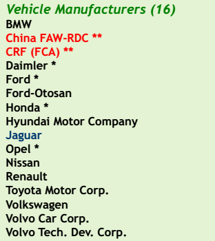 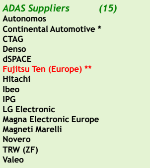 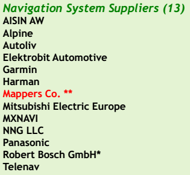 

# 二、History

1. 为了消除各图商、ADAS零部件供应商之间协议的差异，并且更有利于ADAS地图的推广，在2001年5月，来自欧洲汽车行业的汽车制造商、车载系统开发商以及图商联合起来成立了ADASIS Forum，制定地图与ADAS系统之间的通信协议，也就是ADASIS

2. ADASIS v1 在2005年发布，但由于过于复杂，所以基本没人使用。

3. ADASIS Forum在2012年7月发布了第二版标准说明，即ADASIS v2。v2着重降低系统占用的CAN总线资源，以及使用最小原则提取并重构数据。目前ADASIS v2已经被多家车厂采用。

   ADASIS v2结构中包含以下几个部分：

   •ADAS Horizion Provider：地图信息提供者，负责数据组织与发送

   •ADAS Protocol：ADASIS协议

   •ADAS Application（ADAS Horizion Reconstructor）：ADAS应用，负责数据接收与解析及数据的使用。

   •CAN Bus作为信息传送的通道

   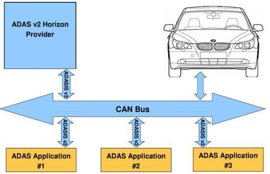

4. ADASIS Forum自2015年6月开始研究ADASIS v3以及基于车身以太网的传输方式。ADASIS v3计划2017年下半年发布，ADASIS v3支持高度自动驾驶HAD。

-----

1. 什么是 ADASIS v3?
ADASIS（Advanced Driver Assistance Systems Interface Specification）直译过来就是 ADAS 接口规格，它要负责的东西其实很简单，就是为自动驾驶车辆提供前方道路交通相关的数据，这些数据被抽象成一个标准化的概念：ADAS Horizon。

数据从地图应用来，要传输到车内的 ADAS 软件应用中。我们常见的互联网传输协议是 Http，内容封装协一般是 json、protocol buffer、xml 等等。但汽车中的数据通信不同于互联网，一般走 CAN 通信，类似于 json，ADASIS v3 就定义了如何在汽车这个大平台下进行数据传输。

简而言之，ADASIS v3 就是一个用于地图数据传输的通信协议。

2. 为什么需要 ADASIS?
做自动驾驶的公司很多，有主机厂、零部件供应商、图商等等。

如果是人驾驶车辆，用基本的导航地图就好了，精度大概在 10 米左右。

从 ADAS 开始，汽车会在某些时候自己进行驾驶，这对于道路感知的要求比较高，ADAS 地图正好可以解决这个问题，ADAS 地图精度大概在 1 米左右。

而未来高度自动驾驶的到来，ADAS 地图的精度就不够用了，因此图商就发力做高精度地图，精度可以达到分米级，配合高精度定位，定位精度能够到厘米级，这种精度能够满足汽车在道路上自动驾驶。

可有一个问题就是从普通的导航地图，再到 ADAS 地图，再到高精度地图，地图的信息是越来越丰富，但每公里的数据量也越来越大。

而汽车上的软件一般跑在 ECU 当中，或者域控制器当中，即使是 Tesla 安置超强的计算平台 FSD,针对这么多的数据量传输也是个头痛的事情。

所以，针对地图与汽车软件之间数据传输就需要好好规划，这需要一套高效、标准的通信协议。

ADASIS 就是这样的协议，它并不是唯一的协议，但它标准、规范，比较多的主机厂参与。

再强调一次，它标准、规范，这说明很多人用。

假设每个主机厂都有一套数据协议，每个图商也有自己的地图传输协议，那这就属于耦合过深，不同车型开发时，将要花费许多额外的时间去做适配，而时间就是金钱。

ADASIS v1 在 2005 年发布，但没有人用。

ADASIS v2 改进了很多，基于 CAN 通信。

ADASIS v3 面向车载以太网通信，带宽更大，所以能够支持高度自动驾驶。

本文快速讲解 ADAS v3 这个版本，我参考的是 v3.1.0 这个版本。

#### ADASIS 基础概念

1. 基本要素

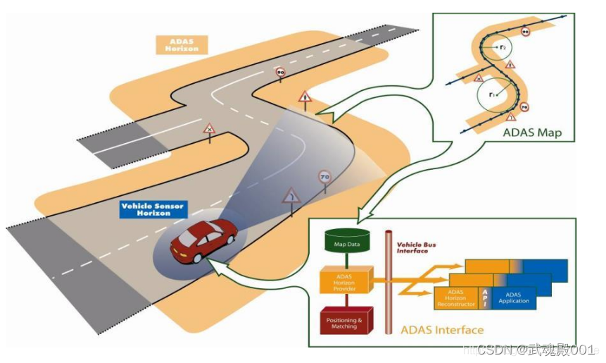

上面的这张图已经可以说明一切了,ADAS Horizon 就像一个开了天眼的人告诉驾驶员或者智能汽车，前方道路有什么。

涉及到 ADASIS v3 开发时，要注意 4 样东西：

AHP(ADAS Horizon Provider) 电子地平线内容提供者
AHR(ADAS Horizon Reconstructor) 数据重构者
ADAS Application
ADASIS v3 Protocol
AHP、AHR、ADAS Application 它们代码可以位于不同进程，甚至不同的 ECU，这算异构技术，当然，高度自动驾驶没有那么多 ECU,那么它们也可以在同一个域控制器或者中央计算平台当中。

下面开始讲解在 ADASIS v3 中地图如何表示。

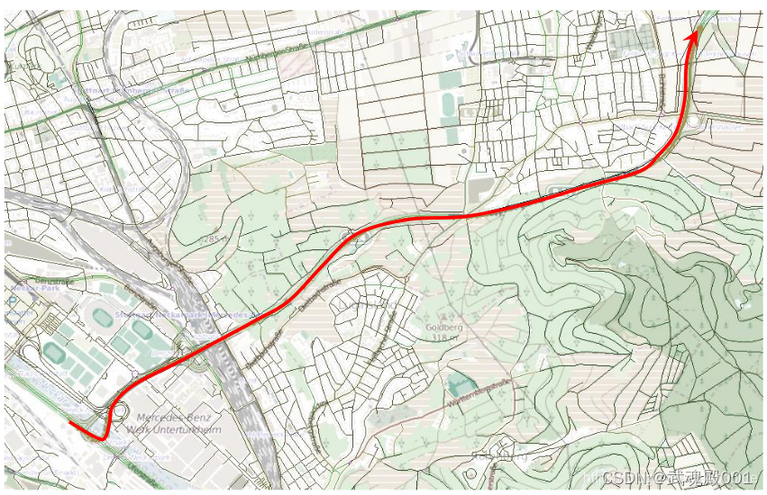

地图信息很多，对于地图的表示也可以按照功能要求从简单到复杂。

ADASIS 倾向于尽可能简单。

如上图所示，你没有必要把每条街道推送给汽车软件，因为很多不需要，所以最简单也是可行的就是尽量推送少但有用的信息。

什么是少但有用的信息呢?

ADASIS v3 给出答案是：

前方道路
可能的道路
于是，Path 的概念就应运而生，可以看看上图那根红线。

Path 精简了地图数据，它只关注汽车可能行驶的路线。

3.2 Path
世上的路千万条，但你每次驾驶时都是走一条确定的路线，这条路线就叫做 Path，它是一种驾驶的可能性。

有了 Path 就可以将路网压缩成线性地图表示。

说是线性，我们可以将 path 看作是一条线，线上挂着许多类别的铃铛、星星等等。

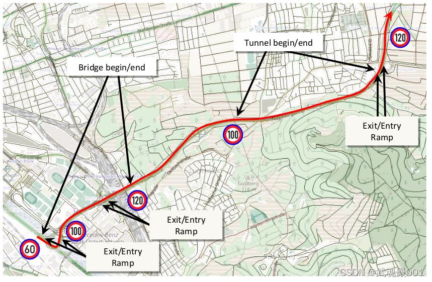

有了这根线和这些铃铛，ADAS Horizon 就差不多成了。

当然，如果只有一条 path 也就是太粗鲁简单了，path 的表示也有粗细之分。

先看看这么一个路网信息：

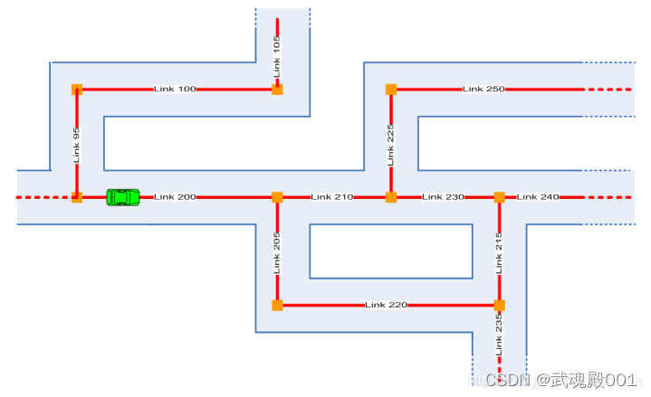

汽车要向前方行驶，Path 信息可以简略表达，也可以复杂点表达。

3.2.1 Simple Path Representation
Simple Path 代表简略表达路网的策略。

如果告诉汽车，要去上图中 Link235 处，那么，有 2 种路由：

200 -> 210 -> 230 -> 215 -> 235
200 -> 205 -> 220 -> 235

把每种可能的路径用 Path 表示出来，而不是把所有的 Link 展示出来就是 Simple Path 的思想，会产生如下结果。

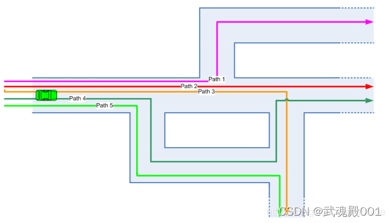

前面说的两种可能，其实就可以用 Path3 和 Path5 表示。

Simple Path 存在冗余，比如上图中所有的 Path 是有相同的起点的，也就是存在重复的数据，大量的重复数据会加剧通信带宽的压力，所以这需要一定的优化。

这涉及到 Path 的另外一种表示：Optimized Path Representation.

3.2.2 Optimized Path Representation
ADASISv3 使用 Optimized Path Representation 表示 Path。

它主要为了减少冗余，并且有了主从之分:

root path
sub path

因为有了主从之分，所以 path 可以形成层次表达。

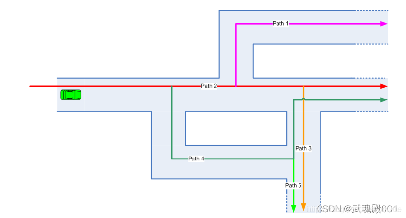

ADAS Horizon 构造器会将汽车最有可能继续行驶的 Path 作为 root path，一般也是 MPP(Most Prefere Path)，而 root-path 下的第一层 sub-path 会作为备选路径。

比如，上图中汽车向前，大概率会沿着 Path2 的方向，但 Path4、Path1、Path3 也是有可能的。

Path 是 ADAS Horizon 最主要的实体，像道路上的路标、十字路口、车道几何信息什么的可以当作 Path 当中的 Attributes。

所以，AHP 首要任务是要传输 Path 信息，AHR 首要任务是要根据 Path 进行路径重建。

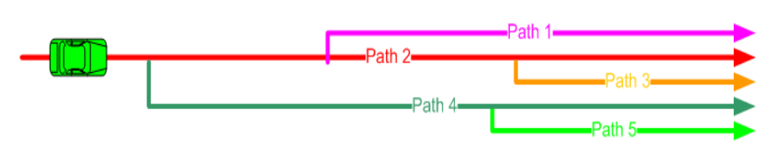

3.2.3 Horizon Length
ADAS Horizon 由一系列的 Path 组成，随着汽车位置的移动，有些新的 Path 会添加进来，一些过时的 Path 就删掉了。

这牵扯到一个视窗的大小，在 ADASIS v3 中由 Horizon Length 决定
horizonlength = greatestoffse – smallestoffset.

做程序实现的时候，最小不能低于某个值，最大也不能超过某个值。

3.3 Profile
前面讲过，Path 可以看做是一根长长的线，上面挂了许多铃铛。

这些铃铛依附在线上，在 ADASIS v3 中用 Profile 表示。

Profile 有不同的类型，可以代表不同的道路相关信息，比如限制车速、路口位置、交通标志等等。

Profile 可能有方向之分：驾驶车同向、对向。

Profile 中的值是离散的，但是它可以表示持续区间，因为它支持插值，插值有 3 种类型：

Spot
Step
Linear

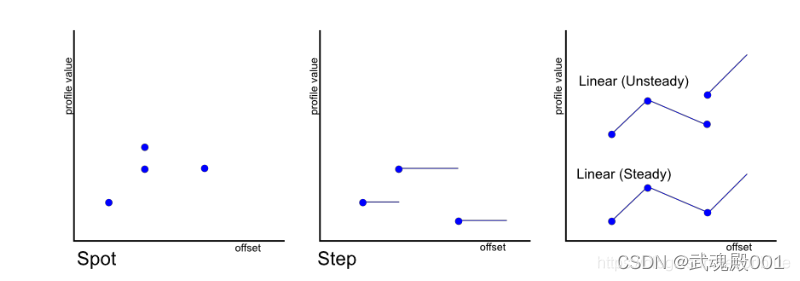

以 Step 为例说明，我们都知道在高速上限速是按区间的。

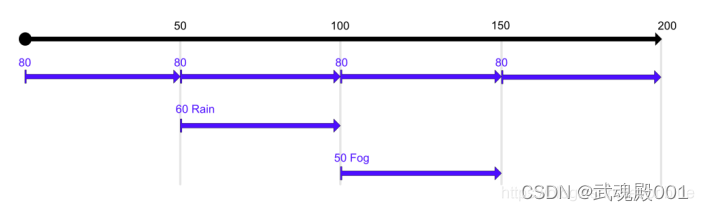

Spot 就是单个点的属性，比如一个交通标志牌，它只需要告诉位置就发了。

Step 是阶段性的持续性的。

上图正常情况是 80 KM/H，但如果下雨或者是雾天，速度就会有所改变，这些额外的 Profile 可以叠加形成层次性限速。

3.3.1 Profile 的层次
因为 HD Map 信息非常多，为了节省带宽但又同时有效提供数据服务，Profile 展开出了层次性。

比如，地图数据被弄成 7 层。

最简单的 ADAS 应用只取第 1 层，第 2 层就好了。

稍微复杂一点的 ADAS 应用取第 1 层到第 4 层。

更复杂的自动驾驶应用可能就要取到第 5 层或者第 6 层去了。

因为有层次，所以能够按需所取，通信带宽压力也可能就缓解了。

3.3.2 Global Data
有些数据不依附于任何 Path，这类数据称为元数据，用 Global data 表示，如软件版本信息、国家编码、天气变化等等。

3.4 Position
Position 代表自车在 Horizon 中各个 path 中的位置，用 offset 偏移量表示。Path 可能是 1 条、2 条或者多条，具体看应用需求而定。

Position 信息封装在 Position Message 当中。

因为 Position 可能映射到多个 path，所以需要一个数组来表示车辆的位置关系，这可以产生这么几种状态：

车子没有在道路上
车子在道路上，匹配到 1 条 path
车子在道路上，匹配到多条 path
车子没有在道路上，但地图上不远处有一条 path
车子正在进入或者离开一条 path
Position 是基于绝对位置进行差分计算的，所以位置的时间戳很重要。

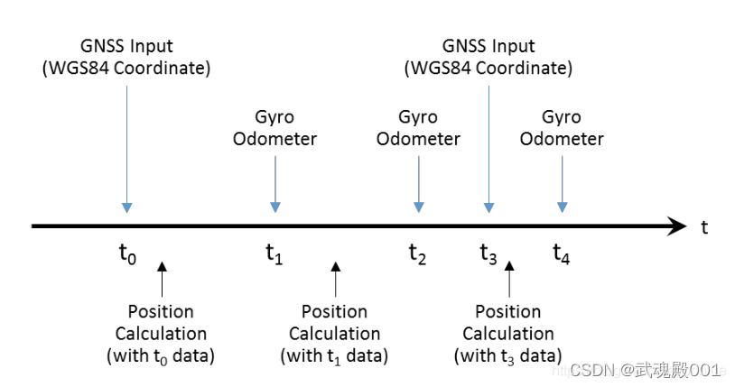

另外，需要注意的是 Position 中的时间戳是全局的，这代表 Provider 和 Reconstructor 的时间是同步没有偏差的，有这个前提才能进行时间对齐。

3.4.1 Preferred Path
Position 中还有一个重要的信息就是 Preferred Path，它代表倾向性的驾驶路径，可以用来描述 MPP(Most Preferred Path)，ADAS Horizon 假设汽车会最大可能沿着这条路径继续下去。

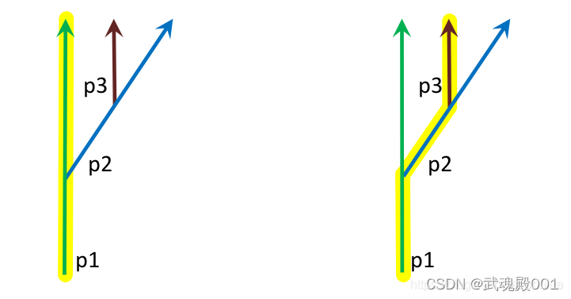

左图说明的是当前路径是 p1, Preferred Path 也是 p1。

右图说明的是当前路径是 p1，Preferred Path 是 p3，p3 到 p1 的路径关系就描述了 MPP.

完整的 Position 信息包括 1 个 timestamp 和一个 position array。

如果没有位置信息或者匹配不上地图时，position array 可能为空。

4. ADASIS v3 管理机制

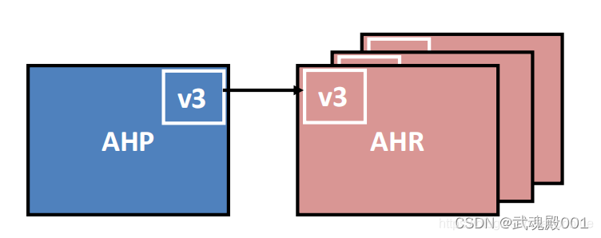

基础的 ADASIS v3 由一个 AHP 和多个 AHR 组成，它们分别代表内容提供者和内容重构者角色，中间进行数据通信。

通信可能走车内网络，如 CAN 或者是车载以太网。

也可能 AHP 和 AHR 就在同一台计算平台上。

这代表分布式和集中式两种架构。

把话题拉回来，通信要传输数据，如何保证高效又不出错呢？这就需要建立一套同步机制。

4.1 同步机制
ADASIS v3 的同步机制有 2 个核心概念：

Path Control
Profile Control
一个负责建立骨架，一个负责向里面填充血肉。

4.1.1 路径同步
其实非常简单，和自动驾驶目标跟踪航迹管理差不多。

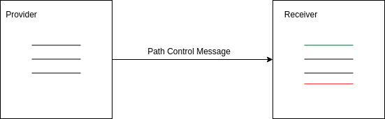

每次 Provider 把所有的 path 封装到 Path Control Message 当中，Receiver 接收到数据后有 3 类操作：

创建，在本地还没有出现的 path，但在 Message 存在的 path，就创建他。
维持，本地也有，Message 当中也有就保持。
删除，本地有，Message 中没有的就删掉它。
比如上面右边的图片，绿色的 path 代表要创建的 path，红色代表要删除的过时的 path。

当Path Control Message 为空时，Receiver 应当删除掉所有的本地的 Path。

4.1.2 Profile 同步
Profile 定义的都是 Path 上的数据，Path 上有许多数据，并且分区间(Range)的,ADASIS v3 用 path control offsets 来指定 range。
Provider 通过 Profile Control Message 更新每一条 Path 对应的 path control offsets。
Reconstructor 根据 path control offsets 来决定删除哪些过时的 attributes。
似乎就这么简单。

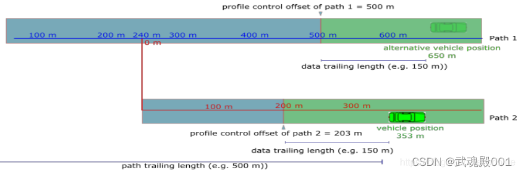

ADASIS v3 中 Path 有自己的生命周期，Path 上的 data 也有自己的生命周期。

当车辆在一条 path 上的位置相对 profile control offset 超过 trailing length 时，offset 前面的 data 就可以被删除掉了。也就是蓝色部分。绿色部分是要保留的内容。

当然，path1 继续保留，直到有明确机制它要被删除，这就是 path 和 path-data 生命周期分离的机制。

Profile 里面的数据同步也离不开这 3 个步骤：

创建
更新
删除

4.1.3 Value Update
每一个 Profile 有一个 ID 编号，这让 AHP 和 AHR 之间可以有数值更新的基础。

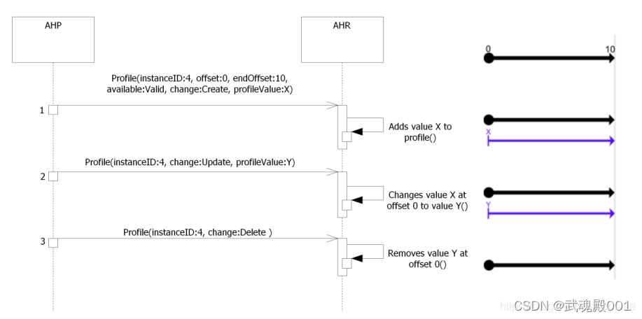

因为 InstanceID 存在，那么 profileValue 就可以根据要求进行 create、update、delete 操作了。

因为 Profile 可以表示任意类型数据，所以上面这种数据同步机制足以应付当前的自动驾驶地图数据通讯。

5 辅助性 Data Provider 和传感器融合
在自动驾驶当中，摄像头和 GPS/IMU 结合地图一起做定位，而 ADASIS v3 没有强制只能有一个 Data Provider 存在。

所以，可以形成一个主 AHP,一个辅助性的 AHP.

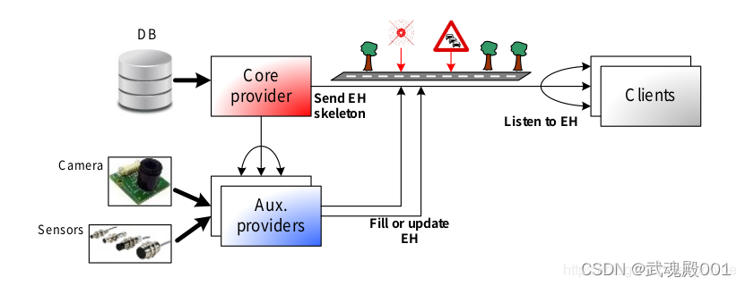

地图的数据走主 provider，感知类的数据走辅助 providers。

主 provider 确证电子地平线的骨架，后面的辅助类做更多数据的填充和更新。

数据融合在自动驾驶当中是个永恒的话题，在 ADASIS v3 也分了两种情况。

5.1 下游融合
这个算后融合吧。

Provider 只管发数据，在 AHR 进行融合

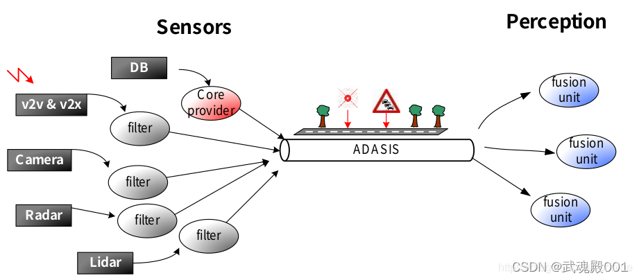

5.2 上游融合
这个算前融合。

Provider 这一侧提前把信息进行融合，AHR 端直接做应用算法处理了。

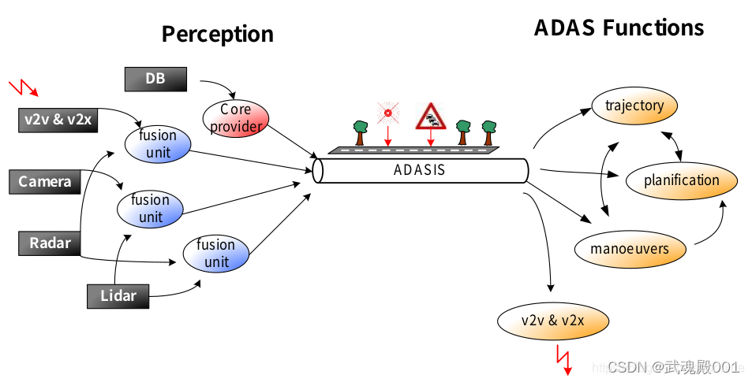

因为前融合可以有效节省通信带宽，所以我个人而言倾向于这一种。

当然，具体使用哪种要结合实际更复杂的情况。

总结
本文是基于阅读 ADASIS v3 的官方文档结合自己的经验理解形成的技术总结，目的是为了快速了解 ADASIS v3 基础概念和通信机制。

因为篇幅有限，没有办法完完整整介绍所有的内容，实际开发如果要参考 ADASIS v3 需要自己仔细阅读文档及参考文档。

当然，前面已经讲过 ADASIS v3 只是地图数据通信协议的一种，你大可根据它的优缺点建立自己的一套体系，但我还是倾向于遵从它，因为汽车行业是个讲标准的行业。

