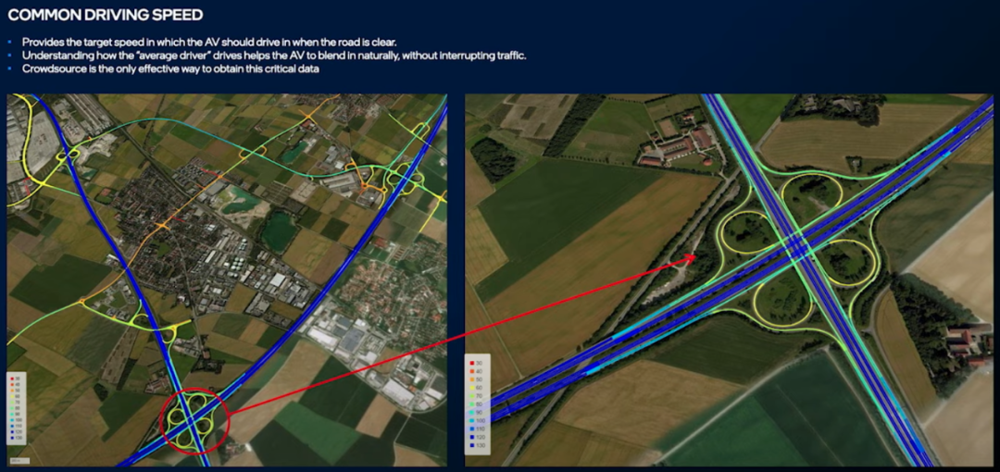

https://blog.csdn.net/xhtchina/article/details/117195298

## 高精地图的挑战

### 规模化-[Scale](https://so.csdn.net/so/search?q=Scale&spm=1001.2101.3001.7020)

如果[自动驾驶](https://so.csdn.net/so/search?q=自动驾驶&spm=1001.2101.3001.7020)车辆只在一个区域、一个城市、或者几个城市运营，那就不存在规模化的问题。但是2025年之后，自动驾驶会在消费者层面全面落地，用户需要驾车到任意想去的地方，在这种场景下，Scale是一个无法规避的问题。

### 鲜度-Fresh

理想情况下，地图是在实时更新的。当物理环境发生变化时，需要实时反映到地图上。月级更新、甚至天级更新都是不够的，我们需要做到分钟级，甚至更短。

### 精度-Accuracy

车载系统(OnBoard System)检测的车辆和行人需要与高精地图(High Definiation Map)实现厘米级精度的匹配，因此地图的精度至关重要。

**全局坐标系下厘米级精度不是必需的**

## 通用高精地图制作方法的缺陷

**全局坐标系下厘米级精度不是必需的**

AV车辆行驶过程中只关注周围几百米范围即可，所以只要这个范围内的足够准确即可。至于几公里之外的全局精度，Who Care...

**语义层数据生产难以自动化**

如下图所示，没有车道线的双向车道，单从图像观察，难以识别它的Drive Path。

如下图所示，转向规则千奇百怪：禁止红灯右转，完全停车后允许红灯右转，绿灯禁止左转，绿灯Yield后允许左转...

如下图所示，红绿灯异常复杂，识别车道、人行横道与红绿灯的关联关系难度很大...

如下图所示，除非地图可以表达所有的3D要素，否则很难自动化的计算出车道的最优Stop/Yield Point。但是表达所有的3D信息对于地图来说又是不现实的...

影响车辆行驶速度的因素有很多，道路几何、限速、文化等，难以量化，但它对Smooth Driving体验至关重要...

## Mobileye如何解决这些问题

scalability依赖众包数据生成Millions Map Agents；Accuracy不是全局的Accuracy，而是局部的Accuracy，相对于道路上的静态元素位置。

REM的处理流程如下，首先从成百上千辆车获取检测信息(没有使用差分GPS，而是使用了普通的GPS)，这些数据传送到云端；每辆车Detection的角度不同，由于遮挡等原因，每辆车检测的landmark也有差异，将这些数据进行Alignment处理，生成高精度的地图数据；最后，Modeling And Semantics负责生成地图的语义数据。

Harvesting

下图中黄色的框是车辆检测的landmarks和lane marks，同时车辆会尝试检测driving path等语义信息，一辆车可能检测不准确，但是成百上千的过路车辆会让检测结果越来越好。

Mobileye Harvesting的数据量为10K/公里，这些检测的数据会被发送到云端。

### Aligning Drives

检测每个RSD中每个元素的6D Pose，然后对齐相同位置的元素，得到厘米度精度的driving path等信息。

由于GPS存在误差，每个车辆检测的道路元素位置都存在噪声，所以只依靠简单的位置求均值是不可行的。

Align之后可以明显的看到两条Driving Path(蓝色)和两侧的道路边界(红色)。对齐的过程是靠几何运算进行。

仅仅靠聚类(Clustering)和Spline Fiting得到下图右上角的结果，这个结果不是特别理想。后来通过神经网络生成高精度地图，效果好了很多。

### 为什么语义理解离不开众包

如下左图所示，通过众包数据可以在没有Lane Marking的道路上获取Driving Path。

如下右图所示，众包数据提供了复杂场景下的所有可通行路径。

如下图所示，通过众包数据可以获得红绿灯与车道的关联关系、Yield Sign的Stop Point、Crosswalk与红绿灯的关联关系等。

如下左图所示，通过检测哪个Drive Path的Stop Point比较多，我们可以从众包数据中获取到没有Traffic Sign情况下各个道路的路权优先级。

如下中图所示，我们可以从众包数据学习到在路口其它司机的停车位置。

如下右图所示，从众包数据可以学习到，在无保护左转的场景下车辆的Stop Point。

众包数据是获得各个道路Common Speed的唯一高效的方法，Common Speed提供了当道路没有车辆时候AV车的目标行驶速度。采用这种方法可以使得无论在哪个国家、地区，或者不同的道路类型，AV车都可以自然的融入车流。

----------

#### Mobileye_Rem（Road Experience Management）

Mobileye的CEO Shashua在CVPR2016上介绍了Road Experience Management（REM），目前仍是视觉高精度地图和定位的（几乎）唯一的解决方案。这两年间，mobileye拉拢了若干主机厂加入REM的联盟，将于今年推出EyeQ4，真正开始REM的量产之路。国内也不乏REM的追随者，如momenta、deep motion等。Mobileye在2016年和2017年申请了一批sparse map、crowd sourcing、navigation相关的专利，内容大同小异。这些专利意在保护整个REM产品，覆盖全面，但技术细节很少提及。这里吐血整理了其中的一篇（200多页的）专利，分享给大家参考。专利为US9665100 - Sparse map for autonomous vehicle navigation。

一些说明

- 整个产品分为系统、众包方法和高精定位方法。其中系统主要包含稀疏地图、传感器和一些数据处理模块。众包部分比较简单，主要介绍了pipeline。定位部分涉及到检测、定位、规划和一些特殊场景。这三部分内容互有交叉，因此区分并不严格。
- 专利并未太多提及目标检测、语义分割等算法。
- 图片中，某些文字下面有一对数字，表示这块内容在专利正文中的位置。如下图，第一个数字为column数（最上面的数字），第二个为行数（右边的小数字）。
  

系统图

众包

高精定位

总图

