CyberRT是一套运行时框架

如果用一句话去总结CyberRT：我觉得CyberRT可以看做是操作系统之上的一层"RTOS"。

RTOS: Real Time Operating System 实时操作系统

如果再加一句话：CyberRT采用携程作为调度的基本单位。将原有的内核态调度，变为用户态调度。系统的线程，在CyberRT眼里，可以看做"CPU"。

如果非要给一个能简化的架构图，我参考了网上的许多解答，可以是下面这样。

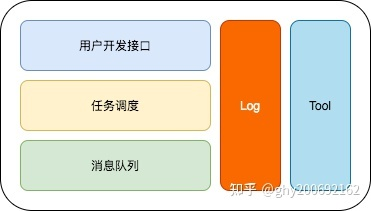

可以粗略的分为上面几个大的模块

- 消息队列：提供节点之间发送，接收消息的能力。涉及到消息的发布，订阅，服务发现，消息buffer等重要功能
- 任务调度：提供任务实时调度的能力，保证算法功能模块可以实时的接收并处理消息。
- 用户开发接口：提供相关接口，将算法模块接入CyberRT的框架之内。
- Log+Tool：提供高效的日志打印，cyber_recorder,cyber_monitor等基础工具

## 二.程序员眼中的CyberRT

先放个四不像的图，后面一点点通过阅读源代码和博客来填补

组要分为3个层级

服务及接口：Component，Service

数据融合，任务调度：

- crontine
- Scheduler
- Data
- Node
- Blocker

数据传输，服务发现：service_discovery，transport

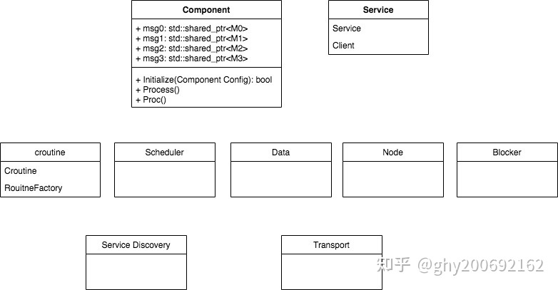

--------

## Cyber RT和ROS对比

| Cyber RT       | ROS               |                             注释                             |
| -------------- | ----------------- | :----------------------------------------------------------: |
| Channel        | Topic             | channel 用于管理数据通信，用户可以通过 Reader/Writer 相同的 channel 来通信 |
| Node           | Node              | 每一个模块包含 Node 并通过 Node 来通信。一个模块通过定义 read/write 和 / 或 service/client 使用不同的通信模式 |
| Reader/Writer  | Publish/Subscribe | 订阅者模式。往 channel 读写消息的类。 通常作为 Node 主要的消息传输接口 |
| Service/Client | Service/Client    |             请求 / 响应模式，支持节点间双向通信              |
| Message        | Message           | Cyber RT 中用于模块间通信的数据单元。其实现基于 Protocol Buffers |
| Parameter      | Parameter         | Parameter 服务提供全局参数访问接口。该服务基于 service/client 模式 |
| Record file    | Bag file          | 用于记录从 channel 发送或接收的消息。 回放 record file 可以重现之前的操作行为 |
| Launch file    | Launch file       | 提供一种启动模块的便利途径。通过在 launch file 中定义一个或多个 DAG 文件，可以同时启动多个 modules |
| Component      | 无                |               组件之间通过 Cyber channel 通信                |
| Task           | 无                |                         异步计算任务                         |
| CRoutine       | 无                |               协程，优化线程使用与系统资源分配               |
| Scheduler      | 无                |                      用户空间任务调度器                      |
| Dag file       | 无                |                  定义模块拓扑结构的配置文件                  |
|                |                   |                                                              |

- 调度的不确定性：各节点以独立进程运行，节点运行顺序无法确定，因而业务逻辑的调度顺序无法保证；
- 运行效率：ROS 为分布式系统，存在通信开销

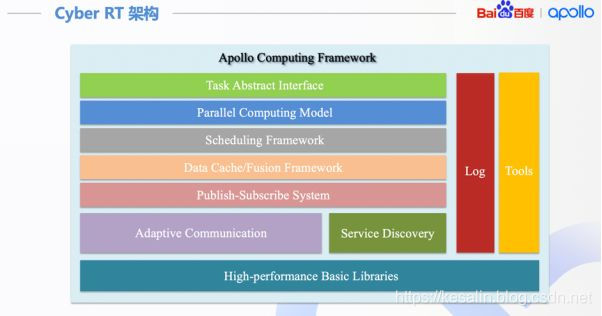

从下到上依次为：

基础库：高性能，无锁队列；
通信层：Publish/Subscribe机制，Service/Client机制，服务自发现，自适应的通信机制（共享内存、Socket、进程内）；
数据层：数据缓存与融合。多路传感器之间数据需要融合，而且算法可能需要缓存一定的数据。比如典型的仿真应用，不同算法模块之间需要有一个数据桥梁，数据层起到了这个模块间通信的桥梁的作用；
计算层：计算模型，任务以及任务调度；

####　三、运行流程

算法模块通过有向无环图（DAG），配置任务间的逻辑关系。对于每个算法可以进行优先级、运行时间、使用资源等方面的配置。
系统启动时，结合DAG、调度配置等，创建相应的任务，从框架内部来讲，就是协程（coroutine）
调度器把任务放到各个 Processor 的队列中。
然后，由 Sensor 输入的数据，驱动整个系统运转。

## 四、特色

- 高性能：无锁对象，协程（coroutine），自适应通信机制；
- 确定性：可配置的任务以及任务调度，通过协程将调度从内核空间转移到用户空间；
- 模块化：在框架内实现组件以及节点，即可完成系统任务；
- 便利性：创建和使用任务

## 五、特色

- 高性能：无锁对象，协程（coroutine），自适应通信机制；
- 确定性：可配置的任务以及任务调度，通过协程将调度从内核空间转移到用户空间；
- 模块化：在框架内实现组件以及节点，即可完成系统任务；
- 便利性：创建和使用任务

------

## Apollo Cyber RT学习

### 什么是Cyber RT？

Cyber RT是百度Apollo推出的代替ROS的消息中间件，它是一个开源、高性能的运行时框架，专为自动驾驶场景而设计。基于中心化的计算模型，针对自动驾驶的高并发、低延迟、高吞吐进行了大幅优化。 自动驾驶的各个模块通过Cyber进行消息的订阅和发布，同时Cyber还提供了任务调度，录制bag包等功能。通过Cyber实现了自动驾驶的中间层。

### 为什么需要Cyber RT？

Apollo 3.5以前使用的系统为ROS，各节点之间的通信方式为进程间的通信。在实际的应用中，ROS在自动驾驶领域遇到很多挑战：

- 首先ROS的算法模块以独立进程的形式存在，独立进程的节点的运行顺序无法确定，因此业务逻辑的调度顺序无法保证。
- 其次，ROS是一个分布式的系统，存在通信的开销。
- 此外，ROS系统中还存在其他很多不确定的地方，比如内存的动态申请。ROS的资源分配时不确定的，

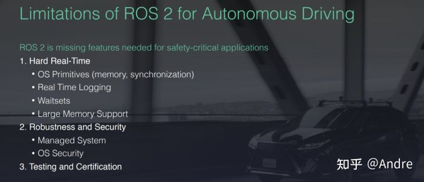

### Cyber RT在Apollo系统中扮演的角色？

Cyber主要的作用就是一个消息中间件，它们需要管理不同的模块，并让它们互相之间可以高效通信。在Apollo6.0中，它作为RTOS和自动驾驶各个模块的中间通信接口。

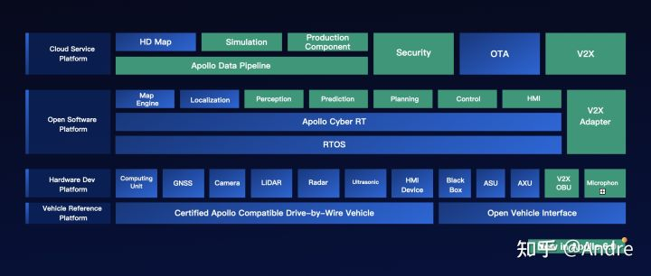

### Cyber RT实现的主要功能

Cyber是一个分布式收发消息，和调度的框架，同时对外提供一系列的工具和井口来辅助开发和定位问题。Cyber提供的功能主要包括一下方面：

- **消息队列：** 主要作用是接收和发送各个节点的消息，涉及到消息的发布、订阅以及消息的buffer缓存等。
- **实时调度：** 主要作用是调度处理上述消息的算法模块，保证算法模块能够实时调度处理消息。
- **用户接口：** Cyber提供了灵活的用户接口(?)
- **开发工具：** 提供了一系列的工具包括消息监控(Cyber_monitor)，消息可视化(Cyber_visualizer)，录制/回放工具(Cyber_recorder), ros包录制(rosbag_to_recorder)。

### Cyber RT的架构

Cyber RT的框架如下图所示：

- 基础库：Cyber RT为了高性能和减少依赖，实现了自己的基础库。(Lock-free的对象池，队列)
- 通信层：Publish/Subscribe机制，Service/Client机制，服务自发现，自适应的通信机制（共享内存、Socket、进程内存）
- 数据缓存/融合层：数据缓存与融合。多路传感器之间数据需要融合，而且算法可能需要缓存一定的数据。比如典型的仿真应用，不同算法模块之间需要有一个数据桥梁，数据层起到了这个模块间通信的桥梁的作用
- 计算层：计算模型，任务以及任务调度
- 接口： Cyber RT为开发者提供了component类，开发者的算法业务模块只需要继承该类，实现其中的proc接口即可。该接口类似于ROS的callback，消息通过参数的方式传递。此外Cyber RT也提供了并行计算的相关接口以及用于开发调试、录制回放的工具。

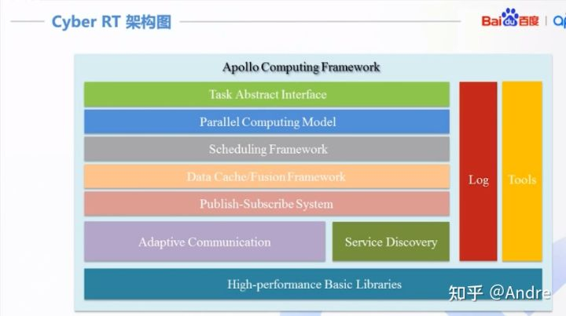

### Cyber RT的运行流程

1. 算法模块：算法模块通过**有向无环图**(DAG, Directed Acyclic Graph)配置任务间的逻辑关系。每个算法都可以进行优先级、运行时间、使用资源等方面的配置。
2. 创建任务：Cyber RT可以结合DAG创建任务，任务的实现方式不是thread，而是协程(coroutine)。
3. 调度器：调度器根据调度、任务配置将任务放入相关Processor的队列中。
4. 数据输入: Senor输入数据驱动系统的运转。

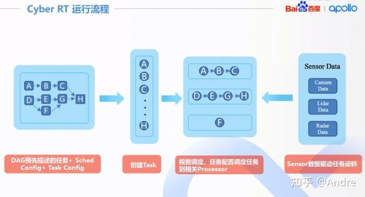

### Cyber RT如何解决ROS所遇到的问题的？

ROS的主要挑战之一是：ROS的算法模块以独立进程的形式存在，独立进程的节点的运行顺序无法确定，因此业务逻辑的调度顺序无法保证。为了解决这个问题，**Cyber RT将调度、任务从内核空间搬到了任务空间，使得调度可以和算法业务逻辑紧密结合。** 从Cyber RT角度，OS的Native thread相当于物理CPU。在OS中，是内核中的调度器负责调度任务（进程、线程……）到物理CPU上运行。而在Cyber RT中，是Cyber RT中的调度器调度协程(Coroutine)在Native Thread上有序运行。

### Cyber RT为什么要使用协程

Apollo将算法模块搭载在协程上，关于协程和线程的区别可以简单的描述为：协程是轻量化的线程，线程是进程下面的多个并行化任务，线程与线程之间的通信必须经过信道进行，然而协程能够直接经过访问全局变量来进行协程之间的通讯。Cyber RT通过croutine模块实现了一个高性能的协程库，为整个系统提供协程的调用。

### Cyber RT的编排调度策略

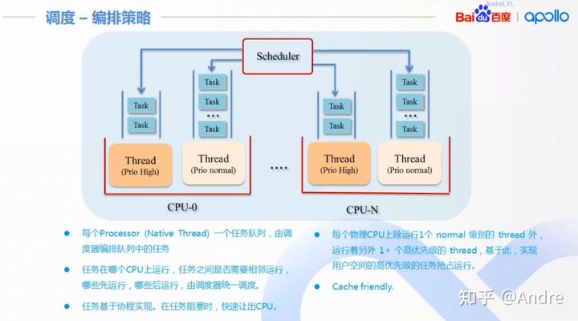

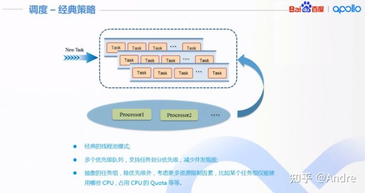

### Cyber RT中的常用术语

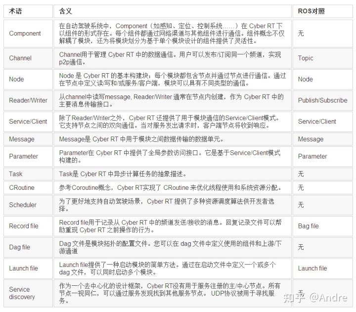

### 如何在 Cyber RT 中创建和运行新组件？

Apollo Cyber RT 框架建立在组件的概念之上。作为 Cyber RT 的构建块，每个组件都是一个特定的算法模块，它处理一组输入并生成一组输出。

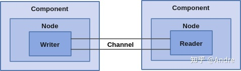

详细步骤参见：[https://github.com/ApolloAuto/apollo/blob/master/docs/cyber/CyberRT_Quick_Start.md](https://link.zhihu.com/?target=https%3A//github.com/ApolloAuto/apollo/blob/master/docs/cyber/CyberRT_Quick_Start.md)

### 参考

[1] https://zhuanlan.zhihu.com/p/91322837 [2] [https://edu.csdn.net/course/play/16425/245037](https://link.zhihu.com/?target=https%3A//edu.csdn.net/course/play/16425/245037) [3] [http://www.javashuo.com/article/p-tuuamgvk-no.html](https://link.zhihu.com/?target=http%3A//www.javashuo.com/article/p-tuuamgvk-no.html)[4] [https://blog.csdn.net/kesalin/article/details/88914029](https://link.zhihu.com/?target=https%3A//blog.csdn.net/kesalin/article/details/88914029) [5] [https://github.com/ApolloAuto/apollo/blob/master/docs/cyber/](https://link.zhihu.com/?target=https%3A//github.com/ApolloAuto/apollo/blob/master/docs/cyber/)