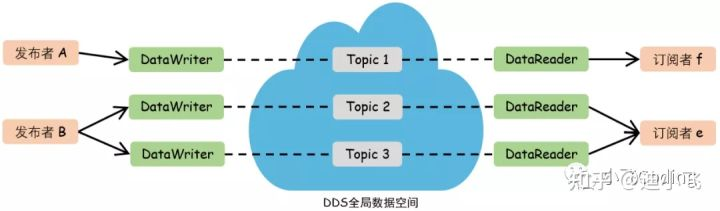
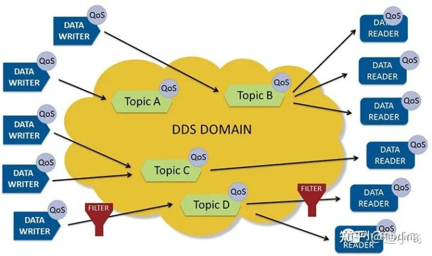
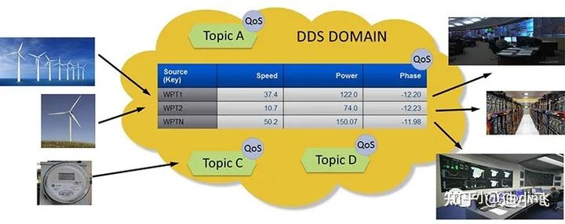
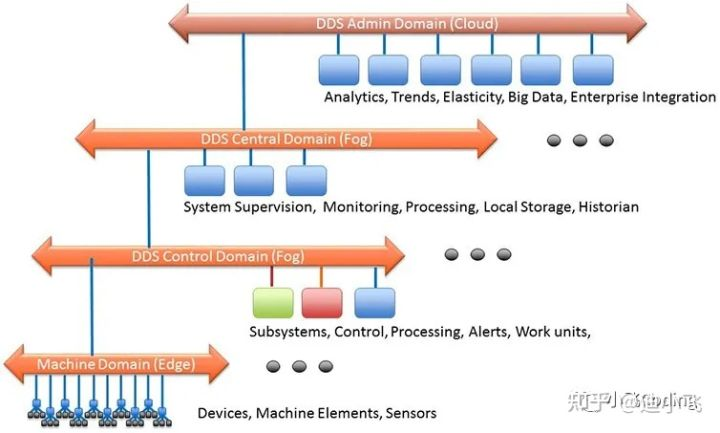

## Data Distribution Service 数据分发服务

近期，在汽车通信圈讨论较火的话题中，DDS绝对排得上号的，我会利用近期空余时间系统梳理下。

- **OMG（Object Management Group）组织**
  提起DDS，就不得不提OMG组织。OMG是一个国际化的、开放成员的、非盈利的计算机行业标准协会，很多大家熟悉的标准(如uml)，都出自于OMG，DDS也是OMG组织推出的标准之一。
- **什么是DDS**

DDS(全称 Data Distribution Service 数据分发服务)，是一个中间件，由OMG发布的分布式通信规范，采用发布/订阅模型，提供多种QoS服务质量策略，以保障数据进行实时、高效、灵活地分发，可满足各种分布式实时通信应用需求。

在汽车领域，Adaptive AUTOSAR在2018年引用了DDS，作为可选择的通信方式之一。DDS的实时性，恰好适合于自动驾驶系统，因此在这类系统中，通常会存在感知，预测，决策和定位等模块，这些模块都需要非常高速和频繁地交换数据。借助DDS，可以很好地满足它们的通信需求。

- **DDS的一些特点**
- 以数据为中心

有许多通信中间件标准和产品。DDS 以独特的数据为中心，非常适合工业物联网。大多数中间件通过在应用程序和系统之间发送信息来工作。数据中心性确保所有消息都包含应用程序理解其接收数据所需的上下文信息。

以数据为中心的本质是 DDS 知道它存储了什么数据并控制如何共享这些数据。使用传统的以消息为中心的中间件的程序员必须编写发送消息的代码。使用以数据为中心的中间件的程序员编写代码，指定如何以及何时共享数据，然后直接共享数据值。DDS 不是在应用程序（您的）代码中管理所有这些复杂性，而是直接为您实现受控、托管、安全的数据共享。

参考自：[https://www.dds-foundation.org/what-is-dds-3/](https://link.zhihu.com/?target=https%3A//www.dds-foundation.org/what-is-dds-3/)

- 全局数据空间

从概念上讲，DDS 将本地数据存储区称为“全局数据空间”。对于应用程序来说，全局数据空间就像通过 API 访问的本地内存。您写入看起来像本地存储的内容。实际上，DDS 会发送消息来更新远程节点上的适当存储。您从看起来像本地商店的地方阅读。

- Quality of Service(QoS)

数据还可以通过灵活的服务质量 (QoS) 规范共享，包括可靠性、系统健康（活跃度）甚至安全性。在真实系统中，并非所有其他端点都需要本地存储中的每个数据。DDS 很聪明地发送它需要的东西。如果消息并不总是到达其预定目的地，则中间件会在需要的地方实现可靠性。当系统发生变化时，中间件会动态确定将哪些数据发送到哪里，并智能地将变化通知参与者。如果总数据量很大，DDS 会智能过滤并仅发送每个端点真正需要的数据。当需要快速更新时，DDS 会发送多播消息以一次更新许多远程应用程序。随着数据格式的发展，DDS 会跟踪系统各个部分使用的版本并自动进行转换。对于安全关键型应用程序，DDS 控制访问、强制执行数据流路径并即时加密数据。当您同时指定所有这些内容时，DDS 的真正力量就会显现出来，以极高的速度，并在一个非常动态、苛刻和不可预测的环境中。

- 动态发现

DDS 参与者可以在同一台机器上或跨网络：应用程序使用相同的 DDS API 进行通信。由于无需了解或配置 IP 地址，也无需考虑机器架构的差异，因此在任何操作系统或硬件平台上添加额外的通信参与者都变得简单、几乎是微不足道的任务。

- 可升缩的架构

  

DDS 系统可以跨越从边缘到雾再到云。在边缘，它们可用于高速实时机器对机器通信。在中间系统内，它们可以提供强大、可靠的 QoS 和内容感知信息流。集成这些系统 DDS 提供可扩展的信息访问和分发，一直到云中和云内。

- 安全

DDS 包括为信息分发提供身份验证、访问控制、机密性和完整性的安全机制。DDS Security 使用分散的对等架构，可在不牺牲实时性能的情况下提供安全性。

参考翻译自：[https://www.dds-foundation.org/what-is-dds-3/](https://link.zhihu.com/?target=https%3A//www.dds-foundation.org/what-is-dds-3/)

- **DDS 相关文档:**

DDS的相关标准包括核心协议(DDSI-RTPS，DDS-XTypes，DDS-Security，Interface Definition Language (IDL)…)，API(DDS C++ API，DDS Java API)，拓展协议(DDS-RPC，DDS-XML…)等13份协议集合。

我这边重点会梳理下面几个标准。

DDS v1.4 描述了用于分布式应用程序通信和集成的以数据为中心的发布-订阅(DCPS)模型

DDSI-RTPS v2.5 定义了实时发布-订阅交互通信协议(RTPS)

IDL v4.2 一种用于以独立于编程语言的方式定义数据类型和接口的语言。这不属于DDS标准，但DDS依赖于它。