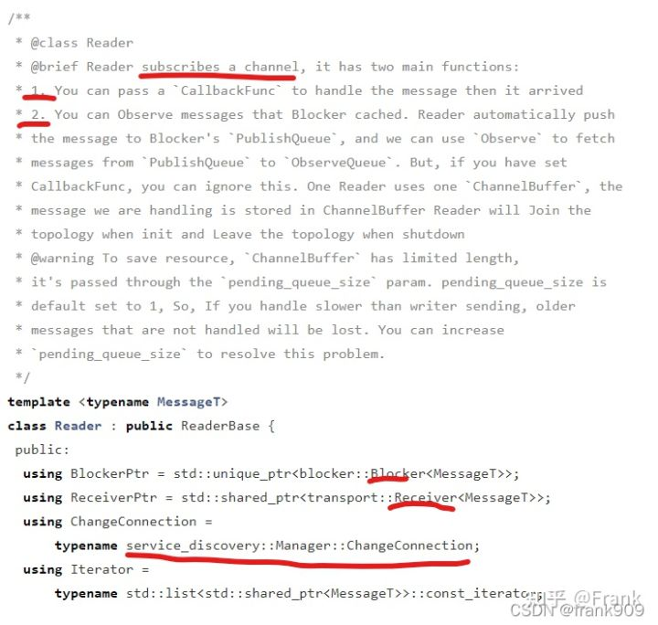

### **1. CyberRT 是什么？**

Apollo Cyber RT 是专为自动驾驶场景设计的开源、高性能运行时框架。 基于中心化计算模型，主要价值是提升自动驾驶系统的高并发、低延迟、高吞吐。

Apollo 并不是一开始就使用 CyberRT，在 v3.0 之前用的都是基于 ROS 框架进行开发。但在之前的版本中发现了很多问题，随着 Apollo 的发展，对最高水平的稳健性和性能的需求， Apollo Cyber RT 应运而生，它满足了一个面向商业化的自动驾驶解决方案的基础需求。

CyberRT 最明显的 3 个优点：

1. 加速算法
2. 简化部署
3. 增强自动驾驶系统能力

本文的目的有 2 个：

1. 弄清楚 CyberRT 的整体框架结构
2. 弄清楚 CyberRT 内部大致协作机制

### **2. CyberRT 里面有什么？**

CyberRT 是一堆庞大复杂的代码，因为我只是一个学习者，我事先也并不知道 CyberRT 的架构图，所以，也只能从代码中分析并从中找线索。
我注意到 Cyber 目录下有 cyber.h 这个文件，我认为它可能是最源头或者是最基础的元素，所以选择了从 cyber.h 入手。

这里面只有一个 CreateNode 方法，返回的是 Node 的引用。根据头文件引用及对代码的敏感性，刨去一些 log、time 之类的辅助类代码，我相信 CyberRT 中这些概念很重要：

- component
- node
- task
- timer

所以，研究 CyberRT 得到 CyberRT 全貌，我们可以从这些概念相应的代码入手。

### **2.1 Node**

在 Node.h 文件中发现了很多有意义的东西。

注释中有提到一些关键信息：

- Node 是 CyberRT 的基础构件
- 任何 Module 包含相应的 Node
- Module 之间的通信也是通过 Node 进行交互
- Node 之间的通信可以设定不同的模式
- Read/Write 是一种 Node 之间的通信方式
- Service/Client 是另外一种 Node 之间的通信方式

另外，node 中的private属性指示了一些关键的成员变量

我们可以知道一个 Node 有一系列相关的 Reader。 也可以有相应的 NodeChannelImpl 和 NodeServiceImpl。

### **2.2 Reader**

注释说了 3 点：

- Reader 通过订阅 Channel 获取信息
- 收到信息时会触发传递到 Reader 的回调 callback
- 也可以监听 Blocker 中的缓存信息

而上面的代码可以告诉我们，Reader 会和一种 Topology 网络发生关系，可以加入，也可以卸载。

并且, Reader 和 Channel 是相关联的,由 ChannelManager 进行管理。

### **2.3 ChannelImpl**

Channel 是 Node 之间通信的桥梁，用来给 Reader 和 Writer 之间建立通信。

### **2.4 TopologyManager**

前方讲到 Reader 会和一种 Topology 网络发生关系，可以加入，也可以卸载。其实 Writer 也一样。所以，我们仍然需要去观察与 Topology 相关的类。

注释里面写明白了我想要的东西：

1. CyberRT 中的元素之间的关系由 Topology 呈现
2. Topology 相当于一个有向图 DAG
3. Node 是 DAG 中的顶点
4. Channel 是 Writer 流向 Reader 的边
5. Service 是 Server 流向 Client 的边
6. Topology 是由 TopologyManager 生成的
7. TopologyManager 内容有 3 个子 Mannager:NodeManager、ChannelManager、ServiceManager
8. NodeManager 是来查找 Node 是否在 Topology 当中
9. ChannelManager 用来查找 Channel 是否在 Topology 当中，以及对应的 Writer 和 Reader
10. ServiceManager 用来查找 Service 是否在 Topology 当中，以及对应的 Server 和 Client
11. TopologyManager 依靠 fast-rtps 进行通信 ，可以监听元素加入和离开 topology 网络
12. 可以自己注册 ChangeFunc 来监听 Topology 网络的变化

所以，大概可以得到下面的示意图。

有了这张图基本上就可以解释 CyberRT 中大多数内容了，但是我注意到前面 Node 中有 Component 和 TimerComponent 的存在，所以，还需要去看看它们到底是什么。

### **2.5 Component**

Component 的基类是 ComponentBase。

从相应的头文件可以看到一些信息提示：

- Component 可以通过一些 .proto 配置
- class loader 可能会加载它
- 内置 Reader
- 有相应的 Node
- 通过 Scheduler 进行调度

我们接下来看 Component 相关的头文件。

感谢 CyberRT 的开发者，关键代码注释的很明白。

- 一个 Component 最多可以支撑 4 个 Channel 进行消息处理
- Component 继承自 Component，开发者可以自定义 Component，只要继承 Component 并复写它的 Init() 和 Proc()
- Init 和 Proc 的调用是由 CyberRT Frame 驱动的，不要主动去调用它们

Initialize 由 protocol 文件进行配置。 Proc 是一个 Component 的逻辑处理单元，包含 4 个参数，分别代表 4 个 channel 的消息。

### **2.6 TimerComponent**

看名字就知道它是一个定时器组件。

TimerComponent 同样继承自 ComponentBase，不过内部有一个定时器 Timer。

Timer 的内部又有两个关键成员变量类型 TimingWheel 和 TimerTask，顾名思义是定时器时间轮换和定时器任务相关的类。

问题是谁触发 TimerTask 呢？

我们很容易想到调度器，而 CyberRT 代码中也正好有一个 scheduler。

问题是 scheduler 又是谁触发的呢？

### **2.7 scheduler**

在一个线团中去找线头是件很难的事情，所以，需要借助于猜测。

我猜测整个 cyberRT 的起源是 init.c 这个文件。

出现了 scheduler 的身影，但这里是设置 log 相关的线程。
所以，我将目光移到 SysMo 上。

SysMo 创建的时候会建立一个线程，里面执行一个 while 循环，然后每次调用 scheduler 的 CheckSchedStatus 方法。

所以，我们终于可以去阅读 scheduler 相应的代码了。

它是一个工厂类，根据策略不同有 SchedulerClassic 和 SchedulerChoreography 两种实现，我在这随便挑选一种也就是 SchedulerClassic 看看它内部长什么样子。

看它的头文件可以发现一些关键要素：

1. 采用协程调度
2. 内部会创建 Processor，并会定期触发通知信息
3. 有一些 ClassicTask，可能代表常规的任务

但聊聊约约我察觉到代码路径离我的目标越来越远，我其实关注的是如何找到 Node 和 Component 的源头，它们是如何被周期触发 proc 方法的。

于是我跳出代码森林，重视审视整个代码目录，然后发现了 mainboard。

### **2.8 mainboard**

发现新大陆了，原来 mainboard 是 cyberRT 的入口，init 方法都在这里触发。

Module 也在这里启动。

ModuleController 几乎藏了我想了解的答案。classloadermanager、componentbase、dag。

class_loader_manager 创建相应的 Component 和 TimerComponent 并对它们进行初始化。

Component 前面的文章讲过，但现在需要关心的是它和 Scheduler 的关系。

在 Component 的 Initialize() 中，Scheduler 会根据 Node 的名字创建一个 Task

### **2.9 再看 Scheduler**

Scheduler 会将 node 与 CRoutine 建立联系，然后与 Processor 也建立联系。

核心点在于 cr，它是协程单元，在 Component 中通过 RoutineFactory 创建。

Routine 是配合 DataVisitor 使用的。

routine 中会创建一个 for 循环,通过 datavisitor 不断去抓取消息，如果有消息则调用 f() 函数处理，否则通过 Yield 将执行权让度出来。
那么 f 函数是什么呢？它是在 CreateRoutineFactory 传递进来的。 源头是 Component 中的 func。

这是一段函数式编程，最终核心逻辑其实是调用 Component 中的 Process()，真相已经很接近了。

Process 中调用 Proc() 方法处理消息，也是本文要探究的目的，整个 CyberRT 的流程包括如何创建 Component，Component如何被消息驱动大致流程都明白了。

当然，与 Component 对应的是 TimerComponent，它应该是定时驱动而不是消息驱动。下面小节，开始分析它。

### **2.10 Timer**

Timer 是在 TimerComponent 中的 Initialize 中被实例化,传入了定时周期和回调函数 func。

func 本身其实是调用 TimerComponent 的 Proc()。

最终 Timer 会将 TimerComponent 中的 Proc 当成 callback 封装成 TimeTask，并设置它们的触发时间，然后添加到内部的 TimingWheel 当中进行任务轮换。基于篇幅，TimingWheel 不再详细分析，因为到此，TimerComponent 的回调函数触发逻辑也已经清楚了。

### **2.11 CyberRT 整体框架全貌**

经过前面小结的分析，可以发现 CyberRT 还是比较复杂和庞大的，研究 CyberRT 一些核心的类展示如下：

1. 核心类是 Component 和 TimerComponent
2. 支撑 component 的是 Node、Scheduler、Timer、DataVisitor
3. 其他的 Reader、Writer、ChannelImple、TimerTask 等等是具体的细节相关类

当然，全部的 CyberRT 不止上图中列出的这些，本文关注的是概貌，细节后续针对某些功能单独分析。

### **3. CyberRT 的协作机制是什么？**

在梳理 CyberRT 相关的类时，其实流程已经基本上弄明白了。

主要的流程有 2 个：

1. Component 和 TimerComponent 的创建过程
2. 它们的消息触发机制

上面的图显示了 CyberRT 创建流程和 Component 消息驱动简单的逻辑，我们可以通过它一览 CyberRT 的基本逻辑，而更精细化的场景则需要更仔细阅读和思考代码，这在后续文章中会陆续分析。

### **4. 总结**

CyberRT 确实很复杂，但经过初步的代码快速阅读，我们可以发现其实它的底层原理也挺简单的。

1. CyberRT 是基于 Fast-RTPS 进行消息驱动的，所以业务模块可以基于此进行数据通讯，这个和 ROS2 没有多大差别;
2. CyberRT 通过 Node 节点进行通信的底层对接，而 Component 则负责具体业务相关的逻辑;
3. CRoutine 基于消息驱动的基础上，将 Component 中的 Proc 回调作为基础的协程执行单元，然后根据 Sheduler 相应的调度策略进行调度，它保证了多任务的执行顺序，但我自己也有个疑问的地方，它能保证进程级别的正常调度吗？
4. TimerComponent 依靠 Timer 进行定时触发，它的 proc 方法被封装成为 TimeTask 中的回调，TimingWheel 根据调度策略进行定时任务执行；
5. CyberRT 强大之处在于它的 3 个拓扑网络，基于 fast-rtps 通过服务发现，能够快速找到相应的 Node 状态，也因为这个特性，这在我之前分析的系统监控 Monitor 中，能够轻松监控每个模块的健康状态。