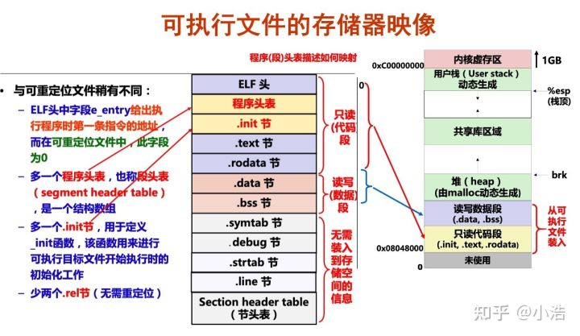

c/c++程序所占用的内存一共分为五种: 栈区,堆区,程序代码区,全局数据区(静态区),文字常量区

C++内存分区：

栈区：存放函数的局部变量，函数的参数等，由操作系统自动管理，无需人工操作。

堆区：存放动态开辟的内存块，如malloc，new等，由程序员来管理，如果申请空间后没有人工释放，那么当程序结束时，操作系统会将其回收。

全局或静态存储区(分为.data段和.dss段)：存放全局变量，静态变量。在程序运行阶段会一直存在，当程序结束时由操作系统释放。注意，在C语言中，未初始化的变量放在.dss区，初始化了的则放在.data段中，C++中不再做区分。

常量存储区：存放的是常量，不可被修改，程序结束后自动释放。

代码区：（.text段）：存放代码不允许修改，但是可以执行，可执行的二进制文件就放在这里。

下面是一段辅助理解的例子。


```cpp
#include <iostream>
using namespace std;

int g_var = 0; // 全局变量，在全局存储区 data段
char *gp_var;  // 全局变量 ，存放在 .dss段

int main()
{
    int var;                    // var   main函数的局部变量，存放在栈区
    char *p_var;                // p_var  同上，存放在栈区
    char arr[] = "abc";         // arr     数组名为常变量，本质依旧为变量，只是有const修饰，存放在栈区
    char *p_var1 = "123456";    //  这里"123456"和"abc"都一样，属于字符串常量，存放在常量区
    static int s_var = 0;       //   static修饰的变量为静态变量，存放在静态区，data段
    p_var = (char *)malloc(10); //     动态开辟的内存 ，存放在堆区
    free(p_var);        
    return 0;
}
```


最后给一张图，如果想继续升入了解的话，可以看一看。（摘录本图只为了让大家了解各个内存区的位置分布情况，看不读懂的不要强行理解，详细请见《深入理解计算机操作系统》）



- 虚函数表放在数据段