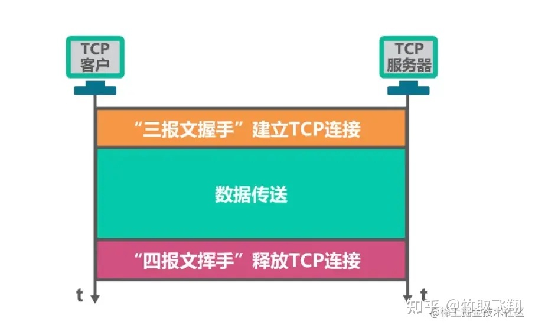
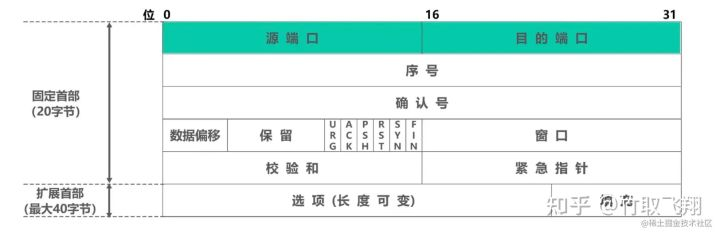
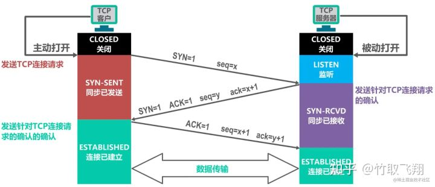

线程之间的通信方式， 常见的有2种：信号通知以及管道通知。

#### 信号通知

通常会有信号的产生端和消费端， 信号的产生端通常是有一个队列， 每当有新的信号产生， 就加入到信号里面， 消费端通常是一个后台线程， 每当收到通知， 信号队列非空， 就会暂时锁定队列， 并且将队列的内容swap到新的队列， 解锁之后， 就可以逐个遍历，处理每个信号。

#### 管道通知

管道是使用非常广泛的一种消息通知机制， 可以用于线程间或者进程间通信。pipe函数会产生2个文件描述符，通过pipe函数创建的这两个文件描述符 fd[0] 和 fd[1] 分别构成管道的两端，往 fd[1] 写入的数据可以从 fd[0] 读出。并且 fd[1] 一端只能进行写操作，fd[0] 一端只能进行读操作，不能反过来使用。要实现双向数据传输，可以使用两个管道。

## 1、TCP是什么？

TCP是面向连接的协议，它基于运输连接来传送TCP报文段，TCP运输连接的建立和释放，是每一次面向连接的通信中必不可少的过程。

TCP运输连接有以下三个阶段：

- **建立TCP连接，也就是通过三报文握手来建立TCP连接。**
- **数据传送，也就是基于已建立的TCP连接进行可靠的数据传输。**
- **释放连接，也就是在数据传输结束后，还要通过四报文挥手来释放TCP连接。**

TCP的运输连接管理就是使运输连接的建立和释放都能正常的进行。

## 2、TCP首部格式

**源端口:** 占16比特，写入源端口号，用来 **标识发送该TCP报文段的应用进程。** **目的端口：** 占16比特，写入目的端口号，用来**标识接收该TCP报文段的应用进程。**

**序号:** 占32比特，取值范围[0,2^32-1]，序号增加到最后一个后，下一个序号就又回到0。**指出本TCP报文段数据载荷的第一个字节的序号。**

**确认号：** 占32比特，取值范围[0,2^32-1]，确认号增加到最后一个后，下一个确认号就又回到0。指出期望收到对方下一个TCP报文段的数据载荷的第一个字节的序号，同时也是对之前收到的所有数据的确认。若确认号=n，则表明到序号n-1为止的所有数据都已正确接收，期望接收序号为n的数据。

**确认标志位ACK：** 取值为1时确认号字段才有效；取值为0时确认号字段无效。**TCP规定，在连接建立后所有传送的TCP报文段都必须把ACK置1。**

**数据偏移:** 占4比特，并以4字节为单位。用来指出TCP报文段的数据载荷部分的起始处距离TCP报文段的起始处有多远。这个字段实际上是指出了TCP报文段的首部长度。

**窗口：** 占16比特，以字节为单位。**指出发送本报文段的一方的接收窗。**

**同步标志位SYN：** 在TCP连接建立时用来同步序号。**终止标志位FIN：** 用来释放TCP连接。**复位标志位RST：** 用来复位TCP连接。

**推送标志位PSH：** 接收方的TCP收到该标志位为1的报文段会尽快上交应用进程，而不必等到接收缓存都填满后再向上交付。

**校验和：** 占16比特，检查范围包括TCP报文段的首部和数据载荷两部分。在计算校验和时，要在TCP报文段的前面加上12字节的伪首部。

**紧急指针：** 占16比特，以字节为单位，用来指明紧急数据的长度。

**填充：** 由于选项的长度可变，因此使用填充来 **确保报文段首部能被4整除**，(因为数据偏移字段，也就是首部长度字段，是以4字节为单位的)。

## 3、TCP的连接建立

TCP 建立连接的过程叫做**握手**，握手需要在客户和服务器之间交换三个TCP 报文段，称之为**三报文握手**，采用**三报文握手**主要是为了防止已失效的连接请求报文段突然又传送到了，因而产生错误。

**TCP的连接建立要解决以下三个问题：**

- 1、使TCP双方能够确知对方的存在 。
- 2、使TCP双方能够协商一些参数（ 最大窗口值是否使用窗口扩大选项和时间戳选项，以及服务质量等）。
- 3、使TCP双方能够对运输实体资源（例如缓存大小连接表中的项目等）进行分配。

**TCP服务器进程收到该确认报文段后也进入连接已建立状态，现在TCP双方都进入了连接已建立状态，他们可以基于已建立好的TCP连接进行可靠的数据传输了。**

**2、“四次挥手”的详解**

所谓的四次挥手即TCP连接的释放(解除)。连接的释放必须是一方主动释放，另一方被动释放。以下为客户端主动发起释放连接的图解：

